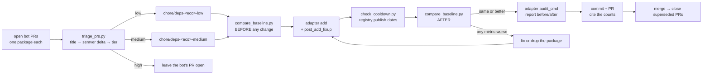
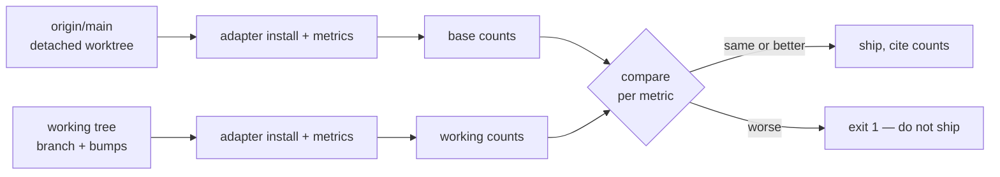

# Workflow at a glance

One branch per ecosystem per tier. Never mix tiers, never mix ecosystems.

## The baseline diff

Both sides run the identical commands the adapter declares; only the tree
differs. The bar is **unchanged**, not green — most repos do not gate every
check in CI, so some are already failing on the base branch.

Exception: if the batch bumps something in the adapter's `baseline_tools`, it
moved its own yardstick. Read the findings diff rather than the count.
