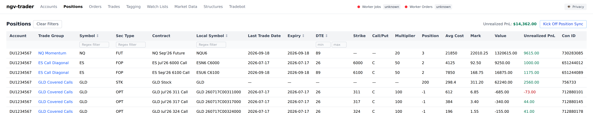
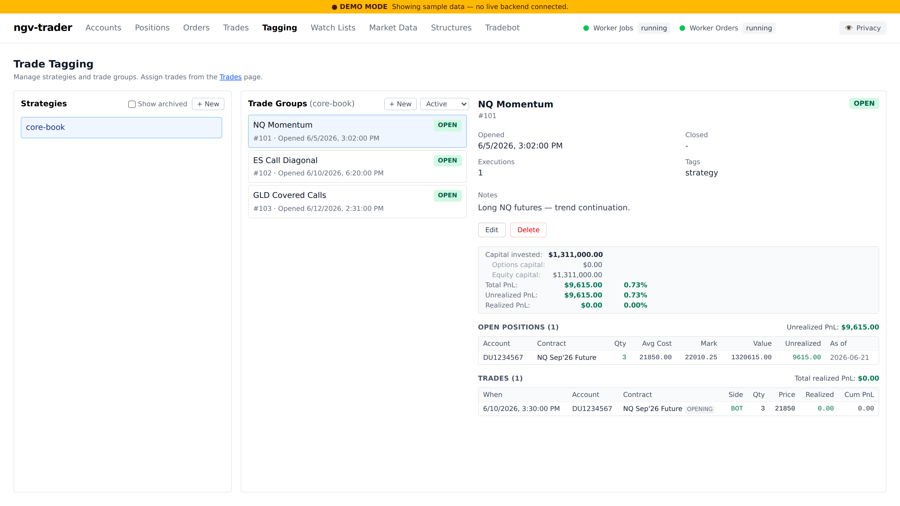
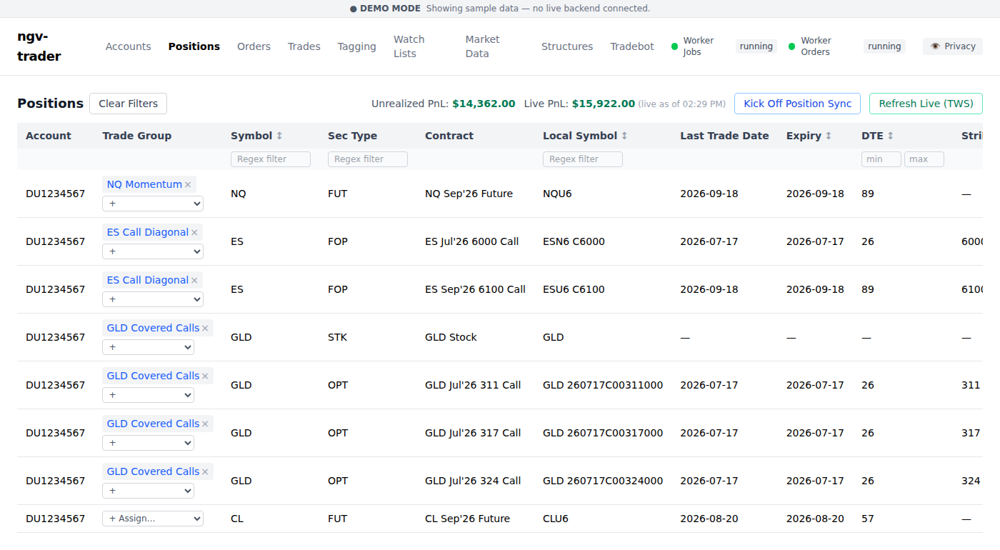

# Next Gen Vol (NGV) Trader

## Getting Started

New to the project? Follow the [Getting Started guide](docs/getting-started.md) for a full walkthrough covering prerequisites, database setup, IBKR configuration, and running the app.

**You assume all risk.**

## Screenshots

### Positions
Track unrealized PnL across accounts, with positions grouped into trades.

### Trade Tagging
Organize executions into strategies and trade groups, with realized/unrealized
PnL rolled up per group.

### Assigning Positions to Trade Groups
Assign individual positions to trade groups directly from the Positions page.

## License

This project offers two license options:

- **Personal Use (free):** for an individual managing less than $1 million USD in AUM.
- **Commercial (super reasonable):** for everything else — reach out to sales@nextgenvol.com.

See [LICENSE](./LICENSE) for full terms.
