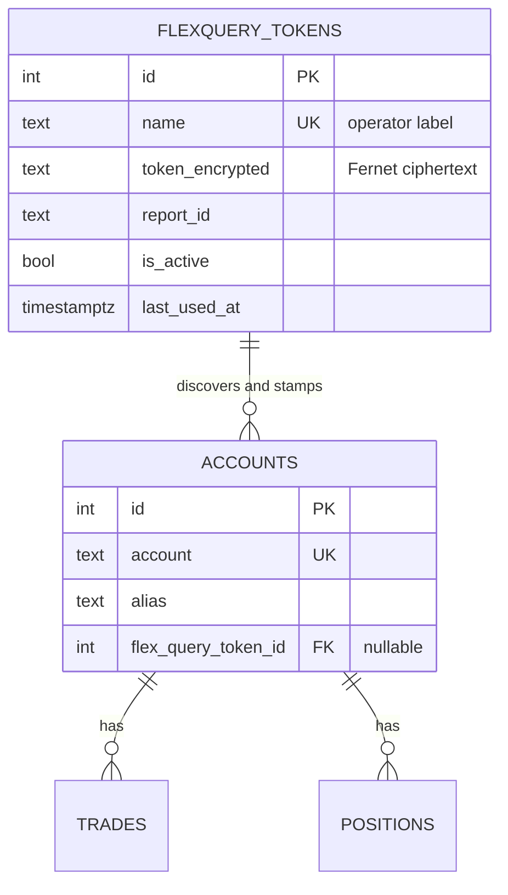
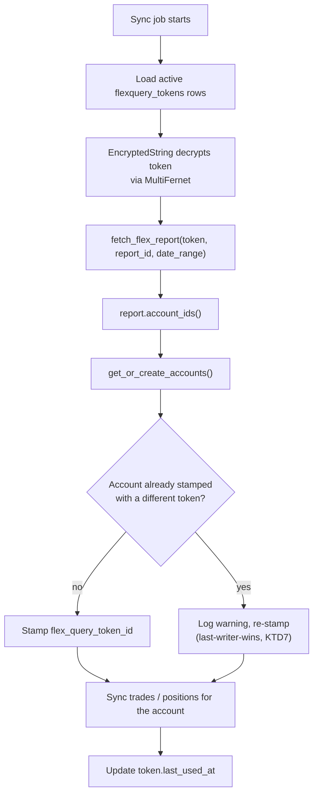

# Encrypted FlexQuery Token Storage - Plan

## Goal Capsule

- **Objective:** Move IBKR FlexQuery credentials out of the `IB_JSON` environment variable and into a `flexquery_tokens` table, encrypted at rest, with `accounts` rows stamped with the token they were discovered under.
- **Authority hierarchy:** Requirements (R-IDs) win on behavior. Key Technical Decisions (KTD-IDs) win on mechanism. Implementation Units override neither.
- **Execution profile:** Backend-only. Touches models, one Alembic migration, the two FlexQuery sync services, the jobs worker, one operator script, and the docs that name `IB_JSON`. No frontend work.
- **Stop conditions:** Stop and surface if the encryption key cannot be resolved from 1Password, if a token's report returns account codes that conflict with an existing stamp in a way R7 does not cover, or if removing `IB_JSON` would break a caller not enumerated in R9.
- **Tail ownership:** Standard — branch, commit, PR. Migration runs against prod via `task migrate ENV=prod` after a snapshot (see Operational Notes).

---

## Product Contract

### Summary

Add a `flexquery_tokens` table that stores each IBKR FlexQuery token encrypted at rest plus its `report_id`, and give `accounts` a nullable foreign key to it. An account's owning token is stamped during sync, as account rows are created from that token's report. This becomes the only credential source for the FlexQuery sync paths; `IB_JSON` and the `flex_token`/`query_id` job-payload override are both removed.

### Problem Frame

FlexQuery credentials live in `IB_JSON`, a JSON blob resolved from 1Password at process launch. Three problems follow from that shape.

The blob is opaque to the application. Nothing in the database records which token covers which account, so the token-to-account relationship exists only in the operator's head and in the shape of the JSON. `handle_trades_sync_flexquery` and `handle_positions_sync_flexquery` both call `_resolve_flex_credentials(payload, None)`, which silently takes the _first_ entry in `IB_JSON` — so a second token is configured but never used by the worker.

The credential is reachable from an untrusted-ish surface. `src/workers/jobs.py:363` reads `payload.get("flex_token")` as an override, and `jobs.payload` is a plain `JSON` column that the jobs API and frontend both read. A prod audit found zero rows carrying that key today, and no code path writes it — but an operator hand-enqueuing a job, or the tradebot agent being steered into it, would persist a live token in cleartext.

The `daily`/`weekly`/`annual` triple in `IB_JSON` is vestigial. It existed because each IBKR query had a statically configured lookback. `ngv_reports_ibkr` now takes the window as a `date_range` parameter — already passed by both sync services — so a single report identifier is all that a token needs.

### Requirements

#### Storage and encryption

- R1. A `flexquery_tokens` table stores one row per IBKR FlexQuery token, identified by an operator-supplied name.
- R2. The token value is encrypted at rest. A reader with database access and no encryption key cannot recover it.
- R3. Encryption and decryption are transparent to application code — the model attribute reads and writes a plain string.
- R4. The encryption key supports rotation without downtime: values written under a previous key remain readable while a new key becomes the write key.

#### Token-to-account mapping

- R5. Each token row carries the single `report_id` used to request its FlexQuery report.
- R6. An `accounts` row records which token it was discovered under, via a nullable foreign key. The foreign key is nullable because accounts predating this work have no known token until their next sync.
- R7. When a sync run resolves a token's report to a set of account codes, each of those accounts is stamped with that token. If an account is already stamped with a different token, the newer token replaces it.

#### Credential resolution and cutover

- R8. The FlexQuery sync paths resolve token and `report_id` from the database, not from the environment.
- R9. `IB_JSON` is removed. No code, env template, or doc reads it or references it after this work: `src/workers/jobs.py`, `scripts/fetch_flex_trades.py`, `.env.example`, `docs/getting-started.md`, `docs/trades-and-executions-sync.md`, `docs/secrets-using-1password.md`, and `AGENTS.md`.
- R10. The `flex_token` and `query_id` job-payload overrides are removed. A job payload cannot supply a credential.
- R11. A sync run covers every active token, not only the first configured one.

#### Operations

- R12. An operator command creates, lists, and deactivates token rows. It reads the token value from an environment variable or stdin, never from a command-line argument.
- R13. An operator command re-encrypts all stored tokens under a new primary key.
- R14. No API response, log line, or exception message contains a decrypted token value.

### Scope Boundaries

- Frontend or API surface for managing tokens — reads and writes stay in the operator CLI for this pass.
- Per-user or per-tenant key scoping. One process-wide key set.
- Cloud KMS or HSM-backed envelope encryption. The key lives in 1Password like every other secret in this repo.
- Encrypting any other existing column. `jobs.payload`, `jobs.result`, and `jobs.last_error` stay plaintext; R10 removes the way a token would reach them.

#### Deferred to Follow-Up Work

- A redaction guard on `jobs.last_error` and `jobs.result` so a future exception carrying a credential cannot persist it. See Risks.
- Introducing a test framework. See KTD8.

### Sources

- `src/workers/jobs.py:335-367` — `_resolve_flex_credentials`, the function this work replaces.
- `src/services/sync_common.py:115-135` — `_ensure_account` / `get_or_create_accounts`, where account rows are created from a report and where stamping hooks in.
- `src/services/trade_sync_flexquery.py:248` and `src/services/position_sync_flexquery.py:35` — the two `fetch_flex_report` entry points that consume a token.
- `ngv_reports_ibkr` v0.5.0 `FlexClient.fetch_flex_report(token, query_id, date_range)` — confirms the pinned version already accepts a date range, so a single `report_id` per token is sufficient. v0.5.0 is the latest tag; no dependency bump is needed.
- [Encryption at Rest with SQLAlchemy](https://blog.miguelgrinberg.com/post/encryption-at-rest-with-sqlalchemy) — the `TypeDecorator` + Fernet pattern this plan adopts, including the Alembic `render_item` note in U3.
- [PostgreSQL encryption options](https://www.postgresql.org/docs/current/encryption-options.html) — the `pgcrypto` tradeoff cited in KTD1: the key reaches the server and the plaintext exists there briefly.
- [SQLAlchemy-Utils data types](https://sqlalchemy-utils.readthedocs.io/en/latest/data_types.html) — `StringEncryptedType`, the off-the-shelf option rejected in KTD1.

---

## Planning Contract

### Key Technical Decisions

- KTD1. **Application-level Fernet through a SQLAlchemy `TypeDecorator`, not Postgres `pgcrypto`.** (session-settled: user-directed — chosen over `pgcrypto`: the key never reaches the database server, so it cannot appear in query logs, `pg_stat_activity`, or a snapshot.) A custom `TypeDecorator` is also preferred over `sqlalchemy_utils.StringEncryptedType`, which binds a single master key at model-declaration time and so cannot express the rotation in R4. Governs R2, R3.
- KTD2. **One env var holds a comma-separated list of Fernet keys; `MultiFernet` reads them.** The first key encrypts; every key is tried on decrypt. Rotation is: prepend a new key, run the re-encrypt command, drop the old key. This is the standard `cryptography` rotation idiom and needs no key-version column. Governs R4, R13.
- KTD3. **Key resolution is lazy and goes through `get_str_env`.** The key is read on first encrypt/decrypt, not at import. Import-time resolution would make `alembic`, `scripts/check.py`, and the API fail to start on a machine without the key, and `get_str_env` already handles `op://` self-resolution (`src/utils/env_vars.py`). Governs R2.
- KTD4. **A single `report_id` per token.** (session-settled: user-directed — chosen over carrying the `daily`/`weekly`/`annual` set: the lookback is now a `date_range` request parameter, so the three IDs collapse to one.) Governs R5.
- KTD5. **Hard cutover; `IB_JSON` is deleted, not deprecated.** (session-settled: user-directed — chosen over retaining it as a fallback for one release: a fallback path keeps a plaintext credential source alive and doubles the resolution logic under test.) Governs R9.
- KTD6. **The foreign key lives on `accounts`, pointing at `flexquery_tokens`.** A token is the parent; accounts are discovered under it. This matches the data flow — `report.account_ids()` returns the accounts a token covers — and means no join table, since an account has exactly one owning token at a time. Governs R6.
- KTD7. **Re-stamping is last-writer-wins.** (session-settled: user-approved — chosen over rejecting a conflicting claim as an error: an account genuinely moving between tokens is likelier than a misconfiguration, and a hard error would stall a sync run over a benign change.) The change is logged at `warning` with masked account codes so a genuine misconfiguration is still visible. Governs R7.
- KTD8. **Verification is script-based, not test-framework-based.** The repo has no pytest or equivalent; `scripts/check.py`, Ruff, Pyright, and `scripts/doc_check.py` are the gates. Rather than introduce a framework as a side effect of this work, the seeding command carries a `verify` action that proves the encrypt/decrypt round trip against the real database. Test scenarios in the units below are expressed as operator checks against that command.
- KTD9. **The token value never crosses the API boundary.** No Pydantic response model exposes it, and the operator CLI prints a masked form only. Governs R14.

### Assumptions

- The token column is `Text` holding Fernet's urlsafe-base64 ciphertext, not `LargeBinary`. Fernet output is already ASCII-safe, and `Text` keeps `psql` inspection and snapshots readable.
- Encrypted tokens are never queried by value — no index, no `WHERE token = ...`. Lookup is by `name` or by the account's foreign key. This is what makes application-level encryption viable here.
- One key set covers all tokens. A per-token data key (true envelope encryption) is unnecessary at this scale.

### High-Level Technical Design

Entity shape after the change:

Credential resolution and stamping, per sync run:

The key itself never enters this flow explicitly — `EncryptedString` resolves it lazily on the first decrypt (KTD3) and `MultiFernet` picks whichever configured key the ciphertext was written under (KTD2).

### Sequencing

U1 precedes U2, which precedes U3 — the column type calls the crypto helper, and the model declares the column type. U3 precedes everything downstream. U4 must land before U5, since U5 stamps accounts using the resolver U4 introduces. U6 is the last code unit — it is the only way to populate the table, so nothing can run end-to-end until it exists. U7 is documentation and env cleanup; it follows U6 because it documents that command's seeding and rotation flows.

---

## Implementation Units

### U1. Fernet key handling and crypto helpers

- **Goal:** A module that resolves the configured Fernet key set and exposes encrypt / decrypt / rotate primitives.
- **Requirements:** R2, R4
- **Dependencies:** none
- **Files:**
  - `pyproject.toml` — promote `cryptography` to a direct dependency
  - `src/utils/crypto.py` — new
- **Approach:**
  1. Add `cryptography` as a direct dependency. It is already resolved transitively at 49.0.0 in `uv.lock`, so no new code enters the tree — but the 14-day cooldown in `AGENTS.md` applies to the direct-dependency add: use `uv add cryptography --exclude-newer "$(date -u -d '14 days ago' +%Y-%m-%d)"` and note the cooldown in the PR description.
  2. Read the key set from a new `FLEX_TOKEN_ENCRYPTION_KEY` env var via `get_str_env` (`src/utils/env_vars.py`), so an `op://` reference self-resolves. Split on commas, strip whitespace, drop empties.
  3. Build a `MultiFernet` from the resulting keys, first key first. Cache it at module scope; resolve lazily on first use, never at import (KTD3).
  4. Raise a clear, actionable error when the var is unset or holds an unusable key — name the variable and point at 1Password. Never include key or token material in the message (R14).
  5. Expose `generate_key()` so U6 can mint one without the operator hand-rolling a Fernet key.
- **Patterns to follow:** `src/utils/env_vars.py` for the `op://` self-resolution and error-message shape.
- **Test scenarios:**
  - Round trip: encrypting a known string and decrypting it returns the original.
  - Multi-key decrypt: a value encrypted under key B decrypts when the configured set is `[A, B]`, with A as primary.
  - Rotation: `MultiFernet.rotate` on a value written under B produces a value that decrypts under A alone.
  - Unset key: with the var absent, the first encrypt raises a named error mentioning `FLEX_TOKEN_ENCRYPTION_KEY`, not a `cryptography` traceback.
  - Malformed key: a non-base64 key value produces the same named error rather than a `binascii` error.
  - Error hygiene: neither error message nor its traceback contains key or plaintext material.
- **Verification:** `uv run python scripts/check.py src.utils.crypto` passes. Ruff and Pyright clean.

### U2. `EncryptedString` SQLAlchemy column type

- **Goal:** A `TypeDecorator` that makes encryption transparent at the model attribute.
- **Requirements:** R3
- **Dependencies:** U1
- **Files:** `src/db_types.py` — new
- **Approach:** Subclass `TypeDecorator` with `impl = Text` and `cache_ok = True`. `process_bind_param` encrypts; `process_result_value` decrypts; both pass `None` through untouched. Keep the type free of any key argument — it calls U1's module-level accessor, which is what makes the key rotatable without touching model declarations (the limitation that rules out `StringEncryptedType` in KTD1).
- **Patterns to follow:** The `TypeDecorator` shape in the Grinberg article cited in Sources.
- **Test scenarios:**
  - Write-then-read through a session returns the plaintext value.
  - The raw column value read via a plain SQL `SELECT` is ciphertext, not the plaintext (this is the R2 proof).
  - `None` round-trips as `None` on both bind and result.
  - A value written before a key rotation still reads correctly after the new key is prepended.
- **Verification:** `uv run python scripts/check.py src.db_types` passes. The ciphertext check is exercised by U6's `verify` action against a real database.

### U3. `FlexQueryToken` model, `accounts` foreign key, and migration

- **Goal:** Persist the table and the relationship.
- **Requirements:** R1, R5, R6
- **Dependencies:** U2
- **Files:**
  - `src/models.py` — add `FlexQueryToken`; add `flex_query_token_id` to `Account`
  - `alembic/versions/<generated>.py` — new migration
- **Approach:**
  1. Add `FlexQueryToken` with: `id`, `name` (unique, not null), `token_encrypted` (`EncryptedString`, not null), `report_id` (not null), `is_active` (not null, default true), `notes` (nullable), `last_used_at` (nullable), `created_at` / `updated_at`. Follow the timestamp defaults used by `Job` (`src/models.py:290-299`).
  2. Add `Account.flex_query_token_id` — nullable integer, `ForeignKey("flexquery_tokens.id", ondelete="SET NULL")`, with an index. `SET NULL` rather than `RESTRICT` so deactivating and deleting a retired token does not require unstitching accounts first.
  3. Generate the migration with `task migrate:new -- "add flexquery_tokens and account token fk"`. Edit only the docstring and the `upgrade`/`downgrade` bodies — never the auto-assigned revision IDs.
  4. Autogenerate will render the custom type as `src.db_types.EncryptedString()`. Either add the import to the migration or map it to `sa.Text()` via Alembic's `render_item`. Prefer `sa.Text()` in the migration body: a migration should not depend on application code that may be refactored later.
  5. Additive only. No backfill — no token rows exist yet, and `flex_query_token_id` is null until U5 stamps it.
- **Patterns to follow:** `alembic/versions/20260801165447_add_last_trade_date_to_live_executions.py` for the docstring-and-body shape.
- **Test scenarios:**
  - `task migrate ENV=prod` applies cleanly; `task migrate:down` reverses it cleanly.
  - After upgrade, existing `accounts` rows are intact with `flex_query_token_id` null.
  - The migration file imports no `src.*` module.
  - Deleting a token row nulls the stamp on its accounts rather than raising a foreign-key error.
- **Verification:** `uv run python scripts/check.py src.models` passes. `task validate ENV=prod` reports migrations at head.

### U4. Database-backed credential resolution

- **Goal:** Replace `_resolve_flex_credentials` with a database lookup and delete the payload override.
- **Requirements:** R8, R10, R11
- **Dependencies:** U3
- **Files:**
  - `src/services/flex_credentials.py` — new
  - `src/workers/jobs.py` — remove `_resolve_flex_credentials`; rewire both handlers
  - `scripts/fetch_flex_trades.py` — rewire to the new resolver
- **Approach:**
  1. Add a resolver returning active token rows: all of them, or one selected by name, or the one stamped on a given account code. Return the decrypted token and `report_id` together.
  2. Rewrite `handle_trades_sync_flexquery` and `handle_positions_sync_flexquery` to iterate every active token rather than taking the first entry (R11). Each token yields its own report; per-account results merge into the existing `per_account` result shape so the jobs API and frontend see no change.
  3. Delete the `payload.get("flex_token")` and `payload.get("query_id")` reads (R10). Keep the existing `account_code` payload filter — it selects which accounts to sync, and is not a credential.
  4. Rewrite `scripts/fetch_flex_trades.py` to resolve by `--name` against the table instead of by `IB_JSON` entry name. Its module docstring names the `daily` query ID; update it for the single `report_id`.
  5. Stamp `last_used_at` on each token after a successful fetch.
  6. Ensure no `RuntimeError` or log line interpolates a token (R14). Where an error must identify the token, use its `name`.
- **Patterns to follow:** `src/utils/ibkr_account.py`'s `mask_ibkr_account` for any account identifier that reaches a log line.
- **Test scenarios:**
  - With two active tokens, one sync run fetches both reports and merges results for accounts under each.
  - An inactive token is skipped.
  - Zero active tokens produces a clear error naming the seeding command, not an `IndexError`.
  - A job payload carrying `flex_token` is ignored — the database token is used regardless.
  - A payload `account_code` still filters the synced set.
  - A fetch failure for one token does not abort the run for other tokens, and the failure message contains the token name, not its value.
  - `last_used_at` advances after a successful fetch and does not advance after a failure.
- **Verification:** `uv run python scripts/check.py src.services.flex_credentials src.workers.jobs` passes. `grep -rn "IB_JSON" src/ scripts/` returns nothing.

### U5. Stamp accounts with their owning token

- **Goal:** Record which token each account was discovered under, as sync creates the account rows.
- **Requirements:** R7
- **Dependencies:** U4
- **Files:**
  - `src/services/sync_common.py` — thread the token through account creation
  - `src/services/trade_sync_flexquery.py`, `src/services/position_sync_flexquery.py` — pass the token
- **Approach:**
  1. Extend `get_or_create_accounts` and `_ensure_account` (`src/services/sync_common.py:115-135`) to accept an optional token id. When supplied, set `flex_query_token_id` on newly created rows and on existing rows whose stamp differs.
  2. Keep the parameter optional. `sync_common` is shared with non-FlexQuery paths; those callers pass nothing and behave as they do today.
  3. When re-stamping an account that already carried a different token, log at `warning` with the account masked via `mask_ibkr_account` and both token names (KTD7).
  4. Stamping is part of the same transaction as the sync write, so a failed sync does not leave a stamp behind.
- **Patterns to follow:** The existing `_ensure_account` flush-then-return shape; do not introduce a second commit boundary.
- **Test scenarios:**
  - A new account discovered under a token is created with that token's id.
  - An existing unstamped account is stamped on its next sync.
  - An account already stamped with the same token is left unchanged and logs nothing.
  - An account stamped with token A, appearing in token B's report, is re-stamped to B and logs one masked warning.
  - A non-FlexQuery caller of `get_or_create_accounts` still works and leaves the stamp null.
  - A sync that raises after account creation leaves no stamp committed.
- **Verification:** `uv run python scripts/check.py src.services.sync_common src.services.trade_sync_flexquery src.services.position_sync_flexquery` passes. After one prod sync, every account in the synced report has a non-null `flex_query_token_id`.

### U6. Operator token management command

- **Goal:** The only supported way to create, inspect, deactivate, and re-key token rows.
- **Requirements:** R12, R13, R14
- **Dependencies:** U4
- **Files:** `scripts/manage_flex_tokens.py` — new
- **Approach:**
  1. Actions: `add`, `list`, `deactivate`, `rotate-key`, `verify`, `generate-key`.
  2. `add` takes `--name` and `--report-id` as arguments and reads the token value from a dedicated env var, falling back to a stdin prompt. Never accept it as an argument (R12) — argv reaches shell history and the process table.
  3. `list` prints name, `report_id`, active flag, `last_used_at`, and the count of stamped accounts. It prints a masked token fingerprint, never the value (R14).
  4. `rotate-key` reads every token row, re-encrypts under the current primary key, and writes back in one transaction (R13). Document the sequence in its docstring: prepend the new key, run `rotate-key`, then drop the old key from 1Password.
  5. `verify` proves the deployment end to end: the key resolves, each stored token decrypts, and a raw SQL read of `token_encrypted` returns something other than the decrypted value. This is the round-trip gate KTD8 substitutes for a test suite.
  6. `generate-key` prints a fresh Fernet key for the operator to paste into 1Password. This is the one command that writes key material to stdout; note in its help text that the output must not be pasted into a shared terminal or a transcript.
- **Patterns to follow:** `scripts/validate_env.py` for operator-script argument and output shape.
- **Test scenarios:**
  - `add` with the token in the env var creates a row whose raw column is ciphertext.
  - `add` with a duplicate name fails on the unique constraint with a readable message.
  - `add` never echoes the token, and the resulting shell history contains no token.
  - `list` output contains no plaintext token for any row.
  - `deactivate` sets `is_active` false and is then skipped by U4's resolver.
  - `rotate-key` with keys `[new, old]` configured re-encrypts every row so all rows decrypt under `[new]` alone.
  - `rotate-key` failing partway leaves every row readable — no row is left encrypted under a key about to be dropped.
  - `verify` passes on a correctly seeded database and fails with a clear message when the key is wrong.
- **Verification:** `uv run python scripts/check.py` passes for the module. Against prod: seed one token, `verify` passes, then a manual FlexQuery sync job completes.

### U7. Remove `IB_JSON` and document the new setup

- **Goal:** No reference to `IB_JSON` survives, and the replacement is documented.
- **Requirements:** R9
- **Dependencies:** U6
- **Files:**
  - `.env.example` — drop the `IB_JSON` block; add `FLEX_TOKEN_ENCRYPTION_KEY`
  - `AGENTS.md:55-61` — rewrite the `IB_JSON` mentions in the Secrets section
  - `docs/getting-started.md:99,239` — replace the env sample and the setup prose
  - `docs/trades-and-executions-sync.md:132` — repoint credential resolution at the table
  - `docs/secrets-using-1password.md:57` — remove `IB_JSON` from the raw-`os.environ` list
  - `docs/_index.md` — update only if a doc is added or renamed
- **Approach:** Replace each reference with the token-table equivalent, and document the seeding and rotation flows where the credential setup is currently described. Keep the guidance high-level and point at `scripts/manage_flex_tokens.py` rather than transcribing its options, per the docs-style rule in `AGENTS.md`. Note that `FLEX_TOKEN_ENCRYPTION_KEY` is read via `get_str_env`, so it self-resolves `op://` and does not require an `op run` wrapper — the same distinction `docs/secrets-using-1password.md:57` already draws for other variables.
- **Test scenarios:** _Test expectation: none — documentation and env template only. Covered by the verification gates below._
- **Verification:** `uv run python scripts/doc_check.py` passes. `grep -rn "IB_JSON" . --exclude-dir=.git --exclude-dir=node_modules --exclude-dir=.venv` returns only entries under `docs/plans/` (dated historical artifacts, which are not rewritten).

---

## Verification Contract

| Gate              | Command                                                    | Applies to     |
| ----------------- | ---------------------------------------------------------- | -------------- |
| Import check      | `uv run python scripts/check.py`                           | U1-U6          |
| Lint              | `uv run ruff check .`                                      | all units      |
| Types             | Pyright clean                                              | all units      |
| Docs              | `uv run python scripts/doc_check.py`                       | U7             |
| IBKR data scan    | `uv run python scripts/ibkr_check.py`                      | before staging |
| Migration         | `task migrate ENV=prod`, then `task validate ENV=prod`     | U3             |
| Crypto round trip | `scripts/manage_flex_tokens.py verify`                     | U1, U2, U6     |
| End-to-end        | One FlexQuery trade sync job completes and stamps accounts | U4, U5         |

Per `AGENTS.md`, do not run Python to exercise code during implementation — use Ruff for fast feedback and require Pyright to pass. The runtime gates above are operator steps performed once the units are complete.

The R2 proof is specific and worth naming: after seeding, a raw `SELECT token_encrypted FROM flexquery_tokens` must return a value that is not the token. Read it, confirm it differs, and do not paste either value anywhere.

---

## Definition of Done

### Global

- Every requirement R1-R14 is implemented or explicitly deferred in this document.
- All Verification Contract gates pass.
- `grep -rn "IB_JSON"` finds nothing outside `docs/plans/`.
- No decrypted token value appears in any log line, API response, exception message, commit, or terminal transcript.
- Abandoned or experimental code from approaches that did not pan out is removed from the diff.
- Commits follow Conventional Commits; the PR notes the `cryptography` direct-dependency add and its cooldown date.

### Per unit

| Unit | Done signal                                                                                                   |
| ---- | ------------------------------------------------------------------------------------------------------------- |
| U1   | Key resolves lazily from `FLEX_TOKEN_ENCRYPTION_KEY`; round trip and rotation both work                       |
| U2   | Model attribute reads plaintext while the raw column holds ciphertext                                         |
| U3   | Migration applies and reverses; `accounts` carries a nullable, indexed token FK                               |
| U4   | Both handlers and the fetch script resolve from the database; every active token syncs; payload override gone |
| U5   | Accounts carry their owning token after a sync; re-stamps log a masked warning                                |
| U6   | An operator can seed, list, deactivate, verify, and re-key without the token reaching argv or stdout          |
| U7   | No `IB_JSON` references remain; setup and rotation are documented                                             |

---

## Risks & Dependencies

- **Key loss is unrecoverable.** Losing `FLEX_TOKEN_ENCRYPTION_KEY` with no copy makes every stored token undecryptable. Mitigation: the key lives in 1Password like every other secret here, and IBKR tokens are re-issuable from the client portal — a lost key means re-seeding, not permanent data loss. Note this in the U7 docs.
- **Application-level encryption defeats database access, not application access.** An attacker with both the database and the application host has the key. This is the accepted tradeoff in KTD1 and it is still a strict improvement over the current state, where the token sits in the process environment of every worker.
- **`jobs.last_error` and `jobs.result` remain plaintext.** R10 removes the way a token reaches a job payload today, but a future exception that interpolates a credential would persist it. Deferred to follow-up; U4 addresses the immediate path by keeping token values out of its own error messages.
- **The migration is additive but the cutover is not.** Once U4 lands, a worker started without `FLEX_TOKEN_ENCRYPTION_KEY` or against an unseeded table cannot sync at all. Sequence the deploy as: migrate, seed via U6, verify, then restart workers.
- **`ngv_reports_ibkr` is pinned to a git tag** (`v0.5.0`, `pyproject.toml:12`). This plan depends on `fetch_flex_report` accepting `date_range`, which v0.5.0 does. A future bump that changes that signature would invalidate KTD4's single-`report_id` premise.

---

## Operational Notes

Take a Postgres snapshot before running the migration in prod — see [db-snapshots.md](../db-snapshots.md). The migration is additive and reversible, so this is precaution rather than necessity; the seeding step that follows is what actually changes credential handling.

Deploy order matters, because KTD5 leaves no fallback:

1. Snapshot.
2. Create `FLEX_TOKEN_ENCRYPTION_KEY` in 1Password and reference it from `.env.prod`.
3. `task migrate ENV=prod`.
4. Seed each token with `scripts/manage_flex_tokens.py add`.
5. `scripts/manage_flex_tokens.py verify`.
6. Restart `worker:jobs`.
7. Run one FlexQuery trade sync and confirm accounts are stamped.

Key rotation, once running: prepend the new key to `FLEX_TOKEN_ENCRYPTION_KEY`, run `rotate-key`, confirm `verify` passes, then remove the old key.
