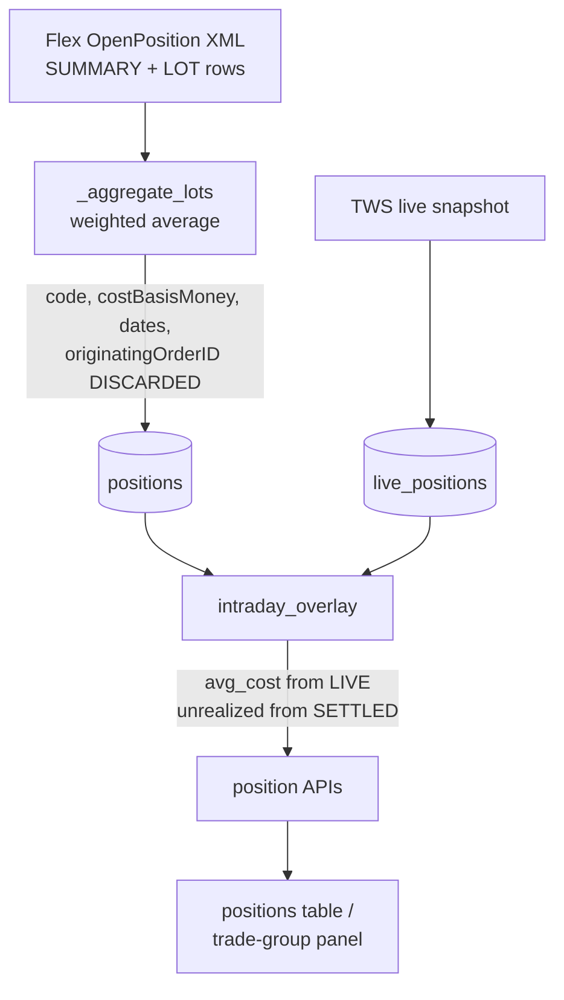
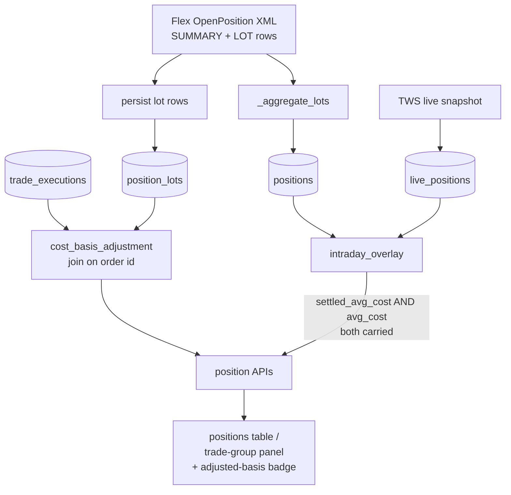

# Tax-Adjusted Cost Basis Reporting - Plan

## Goal Capsule

- **Objective:** A position row reports one cost basis consistently, and IBKR's tax-lot adjustments become visible instead of silently distorting the unrealized PnL shown next to them.
- **Authority hierarchy:** IBKR FlexQuery is the source of truth for both the adjusted basis and the adjustment code. The app derives the *size* of an adjustment by arithmetic against our own execution records; it never determines *whether* an adjustment applies.
- **Execution profile:** Backend first. Migration lands before the sync writes to it; the derivation service lands before the API exposes it; UI last.
- **Stop conditions:** Stop and ask if a FlexQuery report for an account does not return the lot-level fields in R4. Stop if implementing the migration would require mutating existing `positions` rows.
- **Tail ownership:** Standard repo flow — feature branch, `task test`, PR with a demo-mode screenshot.

---

## Product Contract

### Summary

Persist the lot-level detail IBKR already sends, stop pairing a cost basis from one snapshot with an unrealized PnL from another, and mark positions whose basis carries an IBKR tax adjustment so the number on screen is explainable.

### Problem Frame

A position row can show a cost basis and a mark that differ by cents while the unrealized PnL beside them reads in the thousands. Two independent causes produce this.

First, the row mixes sources. `avg_cost` is taken from the live TWS snapshot while `mark_price`, `position_value`, and `fifo_pnl_unrealized` come from the settled FlexQuery snapshot. When the two snapshots disagree about cost basis, the printed PnL cannot be derived from the printed cost and mark.

Second, the two snapshots legitimately disagree. FlexQuery's `costBasisPrice` is the *tax* basis: when IBKR disallows a loss under the wash-sale rule, it adds the disallowed amount to the replacement shares' basis and flags the lot `LD`. TWS reports cash cost. `_aggregate_lots` in `src/services/position_sync_flexquery.py` collapses the lot rows to a weighted average and discards `code`, `costBasisMoney`, `openDateTime`, `holdingPeriodDateTime`, and `originatingOrderID` — so the flag that explains the entire difference never reaches the database, and nothing on screen can account for it.

The realized-PnL path is not defective: `fifoPnlRealized` from the Flex trade rows is IBKR's own economic figure and is reported faithfully. The gap is that the app has no way to express that a reported unrealized loss is a deferred loss rather than a live one.

### Requirements

**Basis consistency**

- R1. A position row never pairs a cost basis from one snapshot with an unrealized PnL derived from another.
- R2. Both the live and the settled cost basis are present on the API response, so each PnL figure can be rendered beside the basis it was computed from.
- R3. Group-level capital-invested totals use the same basis as the unrealized figure they are compared against.

**Lot persistence**

- R4. Each FlexQuery OpenPosition row at `levelOfDetail=LOT` is persisted with `code`, `costBasisMoney`, `costBasisPrice`, `position`, `openDateTime`, `holdingPeriodDateTime`, and `originatingOrderID`.
- R5. The aggregate `positions` row keeps its current shape and meaning; existing consumers continue to read it unchanged.
- R6. Lot rows for an account are replaced wholesale per snapshot, matching the upsert-and-prune behavior `positions` already uses.

**Tax adjustment**

- R7. A lot's adjustment is derived as reported basis minus cash cost, where cash cost comes from `trade_executions` joined on order id.
- R8. The app records no wash-sale determination of its own; the `LD` classification comes from IBKR.
- R9. Economic PnL remains the default headline figure; tax-adjusted figures are additive and never replace it.
- R10. A position whose adjustment cannot be derived (missing or unmatched order id) reports the adjustment as unknown rather than zero.

**Visibility**

- R11. A position whose basis carries an IBKR adjustment is visually marked in the positions table and the trade-group detail panel.
- R12. The marker explains the adjustment amount, the date the disallowed loss was realized, and the inherited holding-period date.

### Scope Boundaries

**Deferred to follow-up work**

- Tax-adjusted metrics in the semantic layer (`v_*` views, `query_metric`, the MCP server). The derivation service this plan builds is the prerequisite; exposing it as a metric is separate work.
- Wash-sale history for *closed* positions. The Flex OpenPosition section only describes open lots; closed-position history needs a different report section.
- Any 1099-B reconciliation or tax-reporting surface.

**Outside this product's identity**

- Computing wash-sale eligibility, substantially-identical matching, or holding-period tacking in-house. The app reports IBKR's determinations; it does not make them.

---

## Planning Contract

### Key Technical Decisions

- KTD1. **Keep `positions` as the aggregate; add `position_lots` alongside it.** (session-settled: user-approved — chosen over replacing the aggregate with lot rows: the trade-group rollups, semantic views, and both position APIs read `positions` today, and a parallel table leaves all of them working unchanged.) Governs R5.
- KTD2. **Derive the adjustment by joining lot `originatingOrderID` to `trade_executions.ib_order_id`.** (session-settled: user-approved — chosen over reconstructing FIFO lots from execution history: FIFO reconstruction must guess IBKR's lot-matching algorithm and reproduced an observed adjustment only to within about one percent, while the order-id join reproduces the reported basis exactly.) Governs R7.
- KTD3. **Report IBKR's `code` field rather than classifying adjustments ourselves.** (session-settled: user-approved — chosen over an in-house tax engine: a wrong determination would be silent and unreviewable, and IBKR already computes and transmits this.) Governs R8.
- KTD4. **Economic PnL stays the default headline.** (session-settled: user-approved — chosen over promoting tax-adjusted figures to the headline: position management runs off economic PnL, and tax basis is a reporting overlay.) Governs R9.
- KTD5. **Carry both bases on the API response instead of choosing one server-side.** The positions table and the trade-group panel present cost differently; a server-side choice would force one surface to re-derive the other basis. Governs R2.
- KTD6. **Replace lot rows per snapshot rather than upserting on a lot key.** Flex lot rows have no stable natural key across snapshots — a single purchase can split into several sub-lots with different bases once an adjustment lands, and the split shape changes between reports. Governs R6.
- KTD7. **Treat an underivable adjustment as unknown, not zero.** Positions acquired by transfer, corporate action, or assignment may carry an empty `originatingOrderID`, and reporting zero would assert "no adjustment" where the truth is "not determined". Governs R10.

### High-Level Technical Design

Current data flow, with the discard point and the mixing point marked:

Target flow:

Column pairing, before and after:

| Displayed figure | Source today | Source after |
| --- | --- | --- |
| Avg Cost | live snapshot | settled snapshot |
| Mark / Value / Unrealized | settled snapshot | settled snapshot |
| Live Cost | not shown | live snapshot |
| Live Mark / Live Unrealized | live snapshot | live snapshot |

### Worked example

Illustrative values only. A lot of 100 shares of `SPY` bought under order `9000000001` at 320.00 reports `costBasisMoney` 37,500.00 with `code` `LD;ST`, `openDateTime` 2025-01-27, and `holdingPeriodDateTime` 2024-11-05.

- Cash cost from executions on order `9000000001`: 100 x 320.00 = 32,000.00
- Derived adjustment: 37,500.00 - 32,000.00 = 5,500.00
- Divergent `holdingPeriodDateTime` records that the holding period was inherited from the replaced lot.

The row is marked, and the marker reports a 5,500.00 disallowed loss with a holding period running from 2024-11-05.

### Assumptions

- The FlexQuery report backing the primary position sync returns the lot-level fields in R4. Verified against a live report during planning. Reports configured under other tokens are unverified — see Open Questions.
- `trade_executions.ib_order_id` is populated for Flex-sourced executions and matches `originatingOrderID` for the same order. Verified against one multi-execution order during planning.
- A single order may produce several executions and several sub-lots; the derivation aggregates both sides per order before differencing.

### Sequencing

U1 and U2 fix the display defect and are independent of everything else — they can land first and alone. U3 through U6 build the tax-adjustment capability in dependency order. U7 consumes it. U8 documents the result.

### Open Questions

- Deferred: do the FlexQuery reports configured under the remaining tokens return the same lot-level field set? Verify before relying on `position_lots` for accounts under those tokens. Non-blocking — U4 degrades to persisting no lot rows when the fields are absent.
- Deferred: should the adjusted-basis marker be always visible or behind a display toggle? Defaulting to always visible; revisit if it proves noisy.
- Deferred: should `positions.avg_cost` be renamed to reflect that it holds the tax basis? A rename touches many consumers and is not required by any requirement here.

### Risks & Dependencies

- Lot rows multiply row count per snapshot. Observed ratio in a live report is roughly two lot rows per aggregate row. Index on `(account_id, con_id, as_of_date)` and prune per snapshot to keep the table bounded.
- `originatingOrderID` can be empty for transferred or assigned positions. R10 and KTD7 require reporting these as unknown; a unit test must cover the empty case.
- `positions.avg_cost` already holds the tax-adjusted basis today. This plan does not change that, and anything currently reading it as cash cost is already wrong. U8 documents the semantics rather than silently changing them.
- Migration is additive (new table, no writes to existing rows), so the snapshot requirement in `AGENTS.md` for hard-to-reverse changes does not strictly apply. Take one anyway before the first prod run, per `docs/db-snapshots.md`.

---

## Implementation Units

### U1. Carry both cost bases through the position view

- **Goal:** `PositionView` exposes the settled cost basis alongside the live one, so no consumer has to choose.
- **Requirements:** R1, R2
- **Dependencies:** none
- **Files:** `src/services/intraday_overlay.py`, `tests/test_intraday_overlay.py`
- **Approach:**
  1. Add `settled_avg_cost: float | None` to the `PositionView` dataclass.
  2. In the live-sourced branch, populate it from the matched Flex row; leave `avg_cost` as the live value.
  3. In the settled-only branch, set both fields to the Flex value.
  4. Leave `compute_unrealized` and the multiplier convention untouched.
- **Patterns to follow:** The existing `settled_mark_price` / `settled_unrealized` / `settled_position_value` fields already model exactly this live-vs-settled pairing; mirror their naming and null semantics.
- **Test scenarios:**
  - A live row with a matching Flex row whose basis differs reports `avg_cost` from live and `settled_avg_cost` from Flex.
  - A live row with no matching Flex row (opened today) reports `settled_avg_cost` as `None`.
  - A settled-only row reports the same value in both fields.
  - `live_unrealized` remains computed from `avg_cost`, not `settled_avg_cost`.
- **Verification:** Overlay tests pass; no change to any existing assertion about `live_unrealized`.

### U2. Stop mixing bases in the position APIs and UI totals

- **Goal:** Every displayed PnL sits beside the basis it was computed from.
- **Requirements:** R1, R2, R3
- **Dependencies:** U1
- **Files:** `src/api/routers/positions.py`, `src/api/routers/trade_groups.py`, `frontend/src/components/PositionsTable.tsx`, `frontend/src/components/TradeTaggingPage.tsx`, `tests/test_api_positions.py`
- **Approach:**
  1. Add `settled_avg_cost` to `PositionResponse` and the trade-group open-position response model.
  2. In `positions.py`, stop overwriting `avg_cost` with the live value for the settled column set; emit both fields.
  3. In `trade_groups.py`, populate `settled_avg_cost` from the view.
  4. In the frontend, render the settled basis in the `Avg Cost` column next to `Mark` / `Value` / `Unrealized`, and add a `Live Cost` column beside `Live Mark` / `Live Unrealized`.
  5. In `TradeTaggingPage.tsx`, change the capital-invested accumulation to use the settled basis so it is comparable to the settled unrealized figure it is displayed with.
- **Patterns to follow:** Column definitions and the `isLiveFresh` gating already present in `PositionsTable.tsx`.
- **Test scenarios:**
  - A position whose live and settled bases differ returns both values distinctly from `/api/v1/positions`.
  - A position with no live row returns equal values in both fields.
  - Group capital-invested for a position with divergent bases equals settled basis times quantity.
  - Group settled unrealized plus capital-invested reconciles to settled position value for a single-position group.
- **Verification:** For a position with divergent bases, cost times quantity plus unrealized equals position value within rounding, using only the settled column set.

### U3. Add the position_lots table

- **Goal:** Schema exists to hold lot-level Flex rows.
- **Requirements:** R4, R5, R6
- **Dependencies:** none
- **Files:** `alembic/versions/` (generated), `src/models.py`, `tests/test_migrations.py`
- **Approach:**
  1. Add a `PositionLot` model: `account_id`, `con_id`, `as_of_date`, `position`, `cost_basis_price`, `cost_basis_money`, `mark_price`, `fifo_pnl_unrealized`, `code`, `open_datetime`, `holding_period_datetime`, `originating_order_id`, `fetched_at`.
  2. Store `code` as the raw IBKR string (`LD;ST`), not a parsed enum — KTD3 means the app transmits IBKR's classification rather than interpreting it.
  3. Index `(account_id, con_id, as_of_date)`.
  4. Generate the revision with `task migrate:new -- "add position_lots"`; edit only the docstring and the `upgrade`/`downgrade` bodies.
- **Patterns to follow:** The `Position` model and the additive table migrations already in `alembic/versions/`.
- **Test scenarios:**
  - Migrations reach head and the new table is present (the existing suite already asserts every model table is covered by a migration).
  - An ORM round-trip persists and reads back a lot row including a null `originating_order_id`.
  - `downgrade` drops the table cleanly.
- **Verification:** `task migrate ENV=dev` reaches head; `task test` passes including the model-coverage canary.

### U4. Persist lot rows during position sync

- **Goal:** Every position sync writes the lot detail alongside the aggregate.
- **Requirements:** R4, R6
- **Dependencies:** U3
- **Files:** `src/services/position_sync_flexquery.py`, `tests/test_position_sync_flexquery.py`
- **Approach:**
  1. Split the lot rows out of the source frame by `levelOfDetail == "LOT"` before aggregating; leave `_aggregate_lots` behavior unchanged so R5 holds.
  2. Insert lot rows for the account, then delete lot rows for that account not belonging to the current snapshot — mirroring the existing prune.
  3. When the lot-level columns are absent from the report, persist no lot rows and log once. Do not fail the sync; the aggregate path must still succeed.
  4. Parse `openDateTime` / `holdingPeriodDateTime` from IBKR's `YYYY-MM-DD;HH:MM:SS TZ` shape, tolerating the empty string used on summary rows.
- **Patterns to follow:** The existing upsert-then-prune block in `sync_flex_positions`, and `_safe_float` / `_safe_int` / `_safe_str` from `src/services/sync_common.py`.
- **Test scenarios:**
  - A report with summary and lot rows persists only the lot rows to `position_lots` and the aggregate to `positions`.
  - A second sync for the same account replaces the prior snapshot's lot rows rather than accumulating them.
  - A report lacking the lot-level columns persists the aggregate and zero lot rows without raising.
  - An empty `openDateTime` parses to null rather than raising.
  - A lot row with an empty `originatingOrderID` persists with null.
- **Verification:** Syncing a fixture report twice leaves lot-row count equal to the fixture's lot count, not double.

### U5. Derive the wash-sale adjustment

- **Goal:** A service reports, per position, how much of the reported basis is an IBKR adjustment rather than cash cost.
- **Requirements:** R7, R8, R10
- **Dependencies:** U3, U4
- **Files:** `src/services/cost_basis_adjustment.py`, `tests/test_cost_basis_adjustment.py`
- **Approach:**
  1. Pure functions over already-loaded rows, following the `intraday_overlay.py` precedent — no DB or HTTP inside the computation.
  2. For each lot carrying `LD` in its `code`, group executions by `ib_order_id` matching `originating_order_id`, sum signed quantity times price plus commission to get cash cost, and subtract from `cost_basis_money`.
  3. Aggregate per `(account_id, con_id)`: total adjustment, earliest `holding_period_datetime` among adjusted lots, and the disallowed-loss date.
  4. Return an explicit unknown when a lot carries `LD` but has no matching executions, per KTD7. Do not silently return zero.
  5. Expose the aggregate as a small dataclass mirroring `PositionView`'s style.
- **Execution note:** Write the derivation test first from the worked example in the Planning Contract — the arithmetic is the whole unit, and a failing test that encodes the expected adjustment is the clearest specification of it.
- **Patterns to follow:** `src/services/intraday_overlay.py` for the pure-function-over-loaded-rows shape and dataclass view style.
- **Test scenarios:**
  - A lot with `code` `LD;ST` and matching executions reports adjustment equal to reported basis minus cash cost.
  - Several sub-lots from one order aggregate to a single adjustment for the position.
  - A lot with no `LD` in its code contributes zero adjustment and does not mark the position.
  - A lot with `LD` but no matching execution reports unknown, not zero.
  - A lot with an empty `originating_order_id` reports unknown.
  - Commissions are included in cash cost, including the negative-commission (rebate) case present in real data.
  - A position with no lot rows at all reports no adjustment and no unknown.
- **Verification:** The worked example reproduces its stated adjustment exactly.

### U6. Expose the adjustment on the position APIs

- **Goal:** Both position surfaces report the adjustment so the UI can render it.
- **Requirements:** R9, R10, R11
- **Dependencies:** U5
- **Files:** `src/api/routers/positions.py`, `src/api/routers/trade_groups.py`, `tests/test_api_positions.py`
- **Approach:**
  1. Load lot rows and the relevant executions alongside the existing position query; keep the query count constant with respect to position count, following the batching discipline in `src/services/trade_group_pnl.py`.
  2. Add `basis_adjustment`, `basis_adjustment_status`, `disallowed_loss_date`, and `holding_period_start` to both response models.
  3. Leave every existing PnL field untouched — R9 means this is additive only.
- **Patterns to follow:** The no-N+1 batching note in `src/services/trade_group_pnl.py`.
- **Test scenarios:**
  - A position with an adjusted lot returns the adjustment and both dates.
  - A position with no adjusted lots returns a null adjustment and a status meaning "none".
  - A position with an underivable adjustment returns the unknown status.
  - Existing unrealized and realized fields are byte-identical to their pre-change values for an unadjusted position.
  - Query count does not scale with the number of positions returned.
- **Verification:** Response for an unadjusted position is unchanged from before the unit.

### U7. Surface the adjusted-basis marker in the UI

- **Goal:** A reader can tell that a reported unrealized loss carries a deferred loss, without leaving the page.
- **Requirements:** R11, R12
- **Dependencies:** U6
- **Files:** `frontend/src/components/PositionsTable.tsx`, `frontend/src/components/TradeTaggingPage.tsx`, `frontend/src/lib/demoData.ts`, `frontend/src/lib/demoApi.ts`
- **Approach:**
  1. Add a compact marker beside the cost basis on rows where an adjustment is present.
  2. On hover or focus, explain the adjustment amount, the disallowed-loss date, and the inherited holding-period start.
  3. Render a distinct marker for the unknown status so it does not read as "no adjustment".
  4. Extend the demo fixtures with one adjusted position and one unknown-status position so the screenshot required by `AGENTS.md` shows real content.
- **Patterns to follow:** Existing badge and staleness-indicator treatments in `PositionsTable.tsx`; the fixture-and-route pattern in `frontend/src/lib/demoApi.ts`.
- **Test scenarios:**
  - `frontend/src/lib/demoData.test.ts` covers the adjusted and unknown fixture shapes against the component types.
  - A position with a null adjustment renders no marker.
  - Manual: the marker's explanation is reachable by keyboard, not hover only.
- **Verification:** `node scripts/screenshot.mjs "/positions?demo=1" ../docs/screenshots/<name>.png` renders the marker with demo data and no backend.

### U8. Document the two bases

- **Goal:** The distinction between cash and tax basis is written down where the next reader will look.
- **Requirements:** R8, R9
- **Dependencies:** U6
- **Files:** `docs/core/intraday-tws-overlay.md`, `docs/trades-and-executions-sync.md`, `docs/_index.md`, one new doc under `docs/`
- **Approach:**
  1. New doc covering: what `positions.avg_cost` actually holds, why it can diverge from the TWS basis, what `position_lots` stores, and how the adjustment is derived.
  2. Note in the overlay doc that the settled and live column sets carry separate bases by design.
  3. Add the new doc to `docs/_index.md` under the architecture section, per the docs index rule in `AGENTS.md`.
- **Test scenarios:** Test expectation: none — documentation only.
- **Verification:** `uv run python scripts/doc_check.py` reports no failures.

---

## Verification Contract

| Gate | Command | Applies to |
| --- | --- | --- |
| Import check | `uv run python scripts/check.py` | U1-U6 |
| Test suite | `task test` | U1-U6 |
| Migration (dev) | `task migrate ENV=dev` | U3 |
| Migration (prod) | `task migrate ENV=prod` after a snapshot per `docs/db-snapshots.md` | U3 |
| Doc checks | `uv run python scripts/doc_check.py` | U8 |
| IBKR data scan | `uv run python scripts/ibkr_sensitive_data_check.py` | all, before staging |
| UI screenshot | `node scripts/screenshot.mjs "/positions?demo=1" ../docs/screenshots/<name>.png` from `frontend/` | U7 |

Per repo convention the suite runs as `uv run --group dev --extra mcp pytest` under the hood; invoke it through `task test`.

---

## Definition of Done

**Global**

- A position row's cost basis, mark, and unrealized PnL are mutually consistent on every surface that renders them.
- Lot-level Flex fields are persisted and pruned per snapshot.
- The derived adjustment reproduces the reported basis exactly for a position with a known adjustment, and reports unknown where it cannot be derived.
- No wash-sale determination is computed by the app.
- Economic PnL figures are unchanged for positions carrying no adjustment.
- `docs/_index.md` lists the new doc.
- The IBKR sensitive-data scan passes on the staged diff.
- Abandoned or experimental code from the implementation run is removed before the PR opens.

**Per unit**

| Unit | Done signal |
| --- | --- |
| U1 | `PositionView` carries both bases; overlay tests green |
| U2 | Cost, mark, and unrealized reconcile within the settled column set |
| U3 | Migration reaches head; model-coverage canary passes |
| U4 | Repeated sync leaves lot count stable, not doubled |
| U5 | Worked example reproduces its adjustment exactly; unknown cases report unknown |
| U6 | Unadjusted-position responses unchanged; query count flat |
| U7 | Screenshot from demo mode shows the marker |
| U8 | `doc_check.py` clean |
