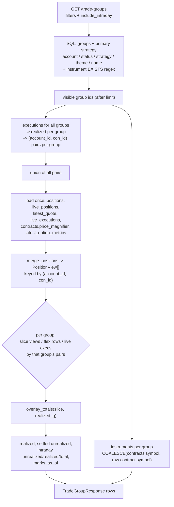

# Strategy P&L Table - Plan

## Goal Capsule

- **Objective:** One flat table where every trade group is a row carrying its strategy, account, instruments, and Total / Realized / Unrealized P&L — filterable by account and by instrument pattern — so the desk can read the whole book in one screen instead of clicking through the three-column Strategies workspace one group at a time.
- **Authority hierarchy:** The settled FlexQuery snapshot is the base; the intraday TWS overlay is an additive read-time layer that degrades to settled values when no live data is present. Neither is invented in this feature — both come from `src/services/intraday_overlay.py`, which stays the single source so the table and the group detail panel cannot show different numbers.
- **Execution profile:** Backend first: batched P&L → instruments and filtering → endpoint surface → UI → demo fixtures → docs. The endpoint is usable and testable before any UI exists.
- **Stop conditions:** Stop and ask if the batched overlay produces per-group figures that disagree with `GET /trade-groups/{id}/executions` for the same group — divergence means the slicing is wrong, and shipping a second set of numbers is worse than shipping nothing. Stop if the instrument filter would require a schema change to perform acceptably.
- **Tail ownership:** Standard repo flow — feature branch, `task test`, `bunx tsc --noEmit`, PR with a demo-mode screenshot.

---

## Product Contract

### Summary

The Strategies page (`/strategies`, `frontend/src/components/TradeTaggingPage.tsx`) is a three-column workspace: pick a strategy, pick one of its trade groups, read that group's detail. It answers "how is this group doing" well and "how is the book doing" not at all — the operator sees one group's P&L at a time and has to hold the rest in their head.

This adds a sibling view: a new top-nav tab rendering one row per trade group, with the strategy as a column, and Total / Realized / Unrealized P&L per row. Account and instrument filters sit above the table. The existing three-column page is untouched.

Most of the backend already exists. `GET /trade-groups` returns each group's `primary_strategy_value` and a batched settled `total_pnl`, and filters on account, status, strategy tag, theme tag, name, and date range. What is missing is the realized/unrealized split, the intraday overlay computed across many groups without an N+1, an instrument concept per group, and the pattern filter over it.

### Problem Frame

The desk runs several campaigns at once across two accounts. Deciding where to add risk, where to take profit, and what has quietly gone wrong is a comparison across groups — but every P&L number in the app today is scoped to a single group's detail panel. Comparing five campaigns means five clicks and five mental snapshots.

Two things make the comparison view non-trivial rather than a cosmetic re-layout:

**The live P&L number is expensive per group.** `compute_trade_group_pnl` loads that group's executions, resolves the `(account_id, con_id)` pairs they touched, pulls settled positions plus live positions plus quotes plus live executions for those pairs, merges them, and totals. Calling it once per row is an N+1 across five tables. The functions it composes (`merge_positions`, `overlay_totals`) are pure over already-loaded rows, so a batched version is possible — but it has to be built deliberately, not by looping.

**A trade group has no instrument.** `trade_groups` links to executions, and executions carry `con_id` but no symbol column — the symbol lives in `contracts.symbol` (incomplete for many traded option `con_id`s, per the `v_execution_facts` migration note) or in `trade_executions.raw['contract']['symbol']` (synthesized by the FlexQuery sync from `underlyingSymbol`). Filtering by `CL.*` means deriving the instrument set from those two sources.

### Requirements

#### Table content

- R1. Every trade group appears as exactly one row. No nesting, no strategy roll-up rows.
- R2. Each row shows the group's primary strategy tag, or a clear "no strategy" state when the group is untagged.
- R3. Each row shows Total, Realized, and Unrealized P&L as separate columns. Each is the intraday-inclusive figure when live data is present and the settled figure otherwise — Total is `intraday_total_pnl` falling back to `total_pnl`, Realized is `intraday_realized_pnl` falling back to `realized_pnl`, Unrealized is `intraday_unrealized_pnl` falling back to `unrealized_pnl`. The three columns always come from the same layer as each other, so Total reconciles to Realized + Unrealized on every row.
- R4. Each row shows the account (by alias, e.g. `lsc`, `main`) and the instruments the group's executions touched.
- R5. P&L figures include the intraday TWS overlay when live data is present, and fall back to settled values when it is not — with a visible freshness indicator, matching the convention on the Strategies and Positions pages.
- R6. A row's figures for a given group equal what `GET /trade-groups/{id}/executions` reports for that same group. One source, no divergence.

#### Filtering

- R7. Filter by account, selected by alias.
- R8. Filter by instrument using a pattern (`CL.*`, `ES`, `CL|NG`), matched against the group's derived instruments and, as a fallback, its name.
- R9. Filter by status, defaulting to `open` so the table is not dominated by closed campaigns.
- R10. Filters compose; an instrument filter selects across the whole set before any row limit is applied, never after.

#### Surface

- R11. A new top-nav tab reaches the table directly. The existing `/strategies` page keeps its nav entry, route, and behavior.
- R12. A row navigates into the existing Strategies page focused on that group.
- R13. Dollar figures respect privacy mode, like every other P&L surface in the app.
- R14. The table renders under demo mode (`?demo=1`) with representative fixtures, so the PR carries a screenshot.

#### Non-regression

- R15. Existing consumers of `GET /trade-groups` — the Strategies page left panel and `TradeGroupSearchSelect` — see no behavior change and pay no new query cost.

### Non-Goals

- Strategy-level subtotals or roll-up rows. Per-group P&L is not additive across groups that share a position (a position touched by two groups is attributed to both), so a subtotal column would double-count. Deferred until that attribution rule is settled.
- Editing from the table — no assignment, no renaming, no status changes. Read-only.
- Changing the group→position attribution rule. This surfaces the existing rule more widely; it does not fix it (see Risks).
- Any schema change. No new tables, no new columns.
- Order-level or working-order projection. That is `docs/plans/2026-08-08-002-feat-working-orders-strategy-overlay-plan.md`.

---

## Planning Contract

### Key Technical Decisions

KTD1. **Batch the overlay; never loop `compute_trade_group_pnl`.** Load the union of every visible group's `(account_id, con_id)` pairs in one pass, merge into `PositionView`s once, then slice per group and call the existing `overlay_totals` on each slice. Query count is fixed regardless of row count — the same shape `trade_group_total_pnls` already uses for settled totals. Looping the per-group function would be an N+1 across `positions`, `live_positions`, `latest_quote`, `live_executions`, `contracts`, and `latest_option_metrics`.

KTD2. **The intraday overlay is opt-in per request; the table opts in.** `GET /trade-groups` gains `include_intraday` defaulting to `false`, so the Strategies page left panel and the group picker keep their current cost (R15). The new table always passes `true`. _(session-settled: user-directed — chosen over settled-only, and over a settled-by-default-with-refresh-button table: the operator wants live numbers on load.)_

KTD3. **Reimplement `trade_group_total_pnls` on top of the batch function.** Both the existing `total_pnl` field and the new split come from one code path, so the settled figures cannot drift apart as the batch function evolves. This is why R6 is checkable rather than aspirational.

KTD4. **Instrument = the underlying symbol, resolved as `COALESCE(contracts.symbol, raw->'contract'->>'symbol')`.** `contracts` is authoritative where present and gives an indexed column; the raw JSON fallback covers the option `con_id`s the security master never got. Both are the _underlying_ root (`CL`), not the local/OCC symbol — the FlexQuery sync writes `underlyingSymbol` into `contract.symbol` and the OCC symbol into `contract.localSymbol`.

KTD5. **The instrument filter is a case-insensitive POSIX regex evaluated in SQL, matched against the group's instruments OR its name.** Postgres `~*` inside an `EXISTS` over the group's executions, `OR` the group name. Regex is what makes the user's literal `CL.*` work; doing it in SQL is what satisfies R10 (filter before limit). The pattern is compiled in Python first so a malformed pattern returns 400 rather than a database error. _(session-settled: user-directed — chosen over instruments-only and over name-only matching: the name fallback catches a group whose fills predate its contract records.)_

KTD6. **A new route and component, not a mode toggle inside `TradeTaggingPage.tsx`.** That file is already 2,511 lines. Route `/strategies/table`, nav label **Strategy P&L**. The exact-match `isStrategiesPage` check in `frontend/src/App.tsx` does not fire for the nested path, so the new page gets the standard layout rather than the workspace's flex layout.

KTD7. **Instruments for display are batched separately from the filter.** The filter is an `EXISTS` (cheap, no fan-out); the display list is one grouped query over the visible groups' executions. Trying to serve both from one query would either fan out the group rows or force a `GROUP BY` that the filter does not need.

### High-Level Technical Design

The batched read path. Every box left of the fan-out runs once for the whole page; only the slicing is per-group, and it is pure Python over already-loaded rows.

The critical property: `merge_positions` runs on the union, not per group. A `(account_id, con_id)` pair shared by two groups produces one `PositionView` that both groups' slices reference — which is exactly the existing attribution semantics (shared positions counted in both groups, figures not additive across rows).

### Assumptions

- Group count is on the order of tens to low hundreds for a single operator. The design holds query count fixed in the number of groups, but does load every visible group's executions in one query; if the book grows past a few thousand executions per page the realized sum becomes the hot path, not the overlay.
- `live_positions` / `latest_quote` are populated only by the intraday TWS sync job. With no recent sync, `intraday_unrealized_total` returns the settled figure and the table shows a stale badge rather than an error. That is the documented graceful-degradation behavior, not a bug to work around.
- Account aliases (`lsc`, `main`) are already set on `accounts.alias`; the filter surfaces them and does not create them.

---

## Implementation Units

### U1. Batched multi-group P&L with the intraday overlay

**Requirements:** R3, R5, R6, KTD1, KTD3

**Dependencies:** none

**Files:**

- `src/services/trade_group_pnl.py`
- `src/api/routers/trade_groups.py` (call-site of the shared loader only)
- `tests/test_trade_group_pnl_batch.py` (new)

**Approach:**

1. Extend the overlay input loader so magnifiers and option metrics are loaded alongside positions/quotes/live rows. Today `load_overlay_inputs` returns four collections and `_build_open_positions_overlay` in `src/api/routers/trade_groups.py` fetches `ContractRef.price_magnifier` and `LatestOptionMetrics` separately. Move that fetch into the loader (or a sibling that wraps it) and have both the detail endpoint and the new batch function consume the same context — a magnifier omitted from one path is exactly how cents-quoted futures come out wrong on one screen and right on another.
2. Add a batch function returning per-group totals for a list of group ids: realized, settled unrealized, intraday unrealized, intraday realized, intraday total, `marks_as_of`, and a group-level live-staleness flag.
   The staleness flag needs defining, because `is_live_stale` is a per-position call today (`_view_to_open_position` in `src/api/routers/trade_groups.py`) and there is no group-level equivalent. Define it as: **true when the group has at least one live-sourced view and every such view is stale.** A group with a mix of fresh and stale marks is not flagged — its `marks_as_of` (the newest mark) already tells the operator how current the figures are, and flagging the whole row on one stale leg would train the operator to ignore the badge. Confirm this rule before implementing; it is the one place this plan defines new semantics rather than reusing existing ones.
3. Internally: one query for executions across all groups (reuse the accumulation already in `trade_group_total_pnls`); build `pairs_by_group` and `settled_exec_ids_by_group`; load the overlay context once for the union of pairs; `merge_positions` once; then per group slice `views`, `flex_rows`, and `live_execs` by that group's pair set and call `overlay_totals` with that group's realized figure.
4. Reimplement `trade_group_total_pnls` as a thin wrapper that calls the batch function and projects the settled total, so the existing `total_pnl` field keeps its exact current meaning and its two-query cost when the overlay is not requested.
5. Give the batch function a flag that skips the overlay load entirely when only settled figures are wanted — that is the path KTD2's `include_intraday=false` takes.

**Patterns to follow:** `trade_group_total_pnls` in `src/services/trade_group_pnl.py` for the batched-executions accumulation and the "two queries regardless of group count" discipline; `compute_trade_group_pnl` in the same file for the per-group composition being replicated; `_build_open_positions_overlay` in `src/api/routers/trade_groups.py` for the magnifier/metrics fetch being lifted.

**Execution note:** Write the equivalence test (scenario 1 below) before the batch function. It is the only cheap guard against R6 silently breaking, and the failure mode — plausible numbers that disagree with the detail page — is invisible without it.

**Test scenarios:**

- For a group with settled executions, open positions, and live rows present, the batch function's figures equal `compute_trade_group_pnl` for that same group, field by field.
- Two groups sharing one `(account_id, con_id)` pair each report the full unrealized for that position (attribution is intentionally non-additive), not a split.
- A group whose executions are all closed round-trips reports realized but `None` settled unrealized.
- A group with no executions reports `None` for every P&L field rather than `0.0`.
- The staleness flag is false for a group whose live views are all fresh, false for a mixed fresh/stale group, and true only when every live-sourced view is stale.
- With no `live_positions` or `latest_quote` rows, intraday figures equal the settled figures (graceful fallback) and `marks_as_of` is `None`.
- A combo group whose executions include `combo_summary` rows reports the combo-aware realized sum, not the sum over legs (existing `trade_group_realized_pnl` behavior, asserted through the batch path).
- Query count does not grow with group count: the same fixed number of statements for 1 group and for 10.

**Verification:** The batch function and the detail endpoint agree on every group in the test fixture, and the statement count for a 10-group call matches the 1-group call.

---

### U2. Group instruments and the pattern filter

**Requirements:** R4, R8, R10, KTD4, KTD5, KTD7

**Dependencies:** none — independent of U1; both consume the same executions join but neither calls the other

**Files:**

- `src/services/trade_group_pnl.py` or a new `src/services/trade_group_instruments.py`
- `tests/test_trade_group_instruments.py` (new)

**Approach:**

1. Add a batched instruments resolver: given group ids, return `{group_id: sorted list of symbols}` from one query joining `trade_group_executions` → `trade_executions`, outer-joining `contracts` on `con_id`, selecting `COALESCE(contracts.symbol, trade_executions.raw -> 'contract' ->> 'symbol')`, distinct, non-null.
2. Add a filter predicate builder: given a pattern string, return a SQLAlchemy condition that is `EXISTS (that same join, correlated to the group, where the coalesced symbol matches the pattern case-insensitively) OR group name matches the pattern case-insensitively`. Use Postgres `~*`.
3. Compile the pattern with Python's `re` first and raise a typed error on failure, so the caller can turn it into a 400. An unvalidated pattern reaching Postgres surfaces as a 500 with a driver error string.
4. Do not add an index in this change. Measure first — the executions table is small enough that a sequential scan under an `EXISTS` is likely fine, and an unmeasured expression index on a JSON extraction is a guess.

**Patterns to follow:** the existing correlated `EXISTS` subqueries for `strategy_tag` and `theme_tag` in `list_trade_groups` (`src/api/routers/trade_groups.py`) — same shape, same `.correlate(TradeGroup)` discipline; `_contract_display_from_raw` for how the raw contract sub-dict is read.

**Test scenarios:**

- A group whose executions have `contracts` rows resolves instruments from `contracts.symbol`.
- A group whose executions have no `contracts` row resolves instruments from the raw contract symbol fallback.
- A group with both resolves each execution independently and returns the deduplicated union.
- Pattern `CL.*` matches a group holding `CL`; pattern `ES` does not.
- Pattern `CL|NG` matches groups holding either.
- A group whose name contains the symbol but whose executions resolve to no instruments still matches (the name fallback).
- Pattern matching is case-insensitive in both directions (`cl.*` matches `CL`).
- A malformed pattern (`CL[`) raises the typed error rather than reaching the database.
- The filter selects across the full set before the limit: with a limit of 2 and three matching groups among ten, two matching groups are returned — not two arbitrary groups filtered down to zero.

**Verification:** Instrument resolution covers both sources on a mixed fixture, and the limit-interaction scenario passes.

---

### U3. Extend `GET /trade-groups`

**Requirements:** R2, R3, R4, R5, R7, R9, R15, KTD2, KTD5

**Dependencies:** U1, U2

**Files:**

- `src/api/routers/trade_groups.py`
- `tests/test_trade_groups_api.py` (new)

**Approach:**

1. Add response fields to `TradeGroupResponse`, all optional and defaulting to `None` so existing consumers are untouched: realized, settled unrealized, intraday unrealized, intraday realized, intraday total, marks timestamp, live-staleness flag, and the instruments list.
2. Keep `total_pnl` exactly as it is — the Strategies page left panel reads it.
3. Add query params: `instrument` (pattern) and `include_intraday` (bool, default `false`). `account_id` and `status` already exist and need no change; the account filter is served by the existing param.
4. In `list_trade_groups`, apply the instrument predicate before `.limit()`, then call the batch P&L function (with or without the overlay per `include_intraday`) and the instruments resolver over the resulting page.
5. Return 400 with a readable message on a malformed instrument pattern.

**Patterns to follow:** `list_trade_groups` as it stands — the batched-after-the-page call to `trade_group_total_pnls` is the exact shape the new calls slot into.

**Test scenarios:**

- Default request (no new params) returns the same fields and values as before the change, with the new fields `None`.
- `include_intraday=true` populates the intraday fields and `marks_as_of`.
- `include_intraday=false` leaves intraday fields `None` and does not query `live_positions` (assert on statement count or via a spy).
- `instrument=CL.*` returns only CL groups; combined with `account_id`, both filters apply.
- `instrument=CL[` returns 400, not 500.
- `status=open` (the table's default) excludes closed and archived groups.
- A group's `realized_pnl` + `unrealized_pnl` in the list equals `total_realized_pnl` + `total_unrealized_pnl` from `GET /trade-groups/{id}/executions` for that group (R6 at the API boundary).
- Instruments appear on rows and are empty (not null-crashing) for a group with no executions.

**Verification:** The R6 cross-endpoint equality test passes, and a default-params request is byte-comparable to the pre-change response for the same fixture.

---

### U4. Strategy P&L table component

**Requirements:** R1, R2, R3, R4, R5, R7, R8, R9, R12, R13

**Dependencies:** U3

**Files:**

- `frontend/src/components/StrategyPnlTable.tsx` (new)
- `frontend/src/lib/tradeGroups.ts` (extend the shared row type)
- `frontend/src/components/strategyPnlTable.test.ts` (new — pure helpers extracted from the component)

**Approach:**

1. Fetch `GET /trade-groups` with `include_intraday=true`, the current status filter, the optional `account_id`, and the optional `instrument` pattern. Refetch on filter change, debouncing the instrument input.
2. Columns: Strategy, Group, Account, Instruments, Realized, Unrealized, Total, Status, and a marks-freshness cell. Sortable on the P&L columns.
3. Filter controls above the table: an account select populated from `GET /accounts` showing `alias`, a free-text instrument pattern input with `CL.*` as placeholder text, and a status select defaulting to `open`.
4. Freshness: show `live as of HH:MM` when `marks_as_of` is present and not stale, an amber `stale HH:MM` badge when the staleness flag is set. Include a "Refresh Live (TWS)" button that posts to the intraday sync endpoint and refetches, matching the two pages that already have one — without it a stale table has no in-page remedy.
5. Row click navigates to `/strategies` targeting the group.
6. Mask dollar figures under privacy mode (see the open question on the percent-return convention).
7. Handle the states a filtered table has and a static one does not: loading (initial fetch and refetch-on-filter-change), empty-because-filtered (distinguish "no groups match `CL.*`" from "no trade groups exist"), and fetch error. Silence on any of these reads as a broken page.

**Patterns to follow:** `frontend/src/components/PositionsTable.tsx` for the sort-column state machine (`sortColumn` / `sortDirection` / `toggleSort`, the `↕ ↑ ↓` indicators, and the `aria-sort` handling) and for the `useResizableColumn` hook; `frontend/src/components/TradeTaggingPage.tsx` for the "Refresh Live (TWS)" post-then-refetch flow and the stale-badge markup; `frontend/src/utils/number.ts` `formatMoney` and `frontend/src/utils/privacy.ts` `PRIVACY_MASK` for cell formatting; `tradeGroupLabel` in `frontend/src/lib/tradeGroups.ts` for the "no strategy" fallback wording.

**Test scenarios:** The repo has no component-test harness and adding one is out of scope, so the testable surface is the pure logic — extract it from the component into module-level helpers and cover it in `frontend/src/components/strategyPnlTable.test.ts` (new):

- The sort comparator orders by a numeric P&L column descending, ascending, and back to unsorted across three `toggleSort` calls.
- The sort comparator places rows with `null` P&L last in both directions rather than treating them as zero.
- The freshness formatter returns a `live as of HH:MM` label for a fresh `marks_as_of`, a `stale HH:MM` label when the staleness flag is set, and no label when `marks_as_of` is null.
- The query-string builder omits absent filters entirely (no `instrument=` with an empty value) and always includes `include_intraday=true`.
- The instruments cell formatter renders a single symbol plain, several as a comma-joined list, and an empty set as the em-dash placeholder rather than an empty cell.
- The strategy cell falls back to the "no strategy" label when `primary_strategy_value` is null, matching `tradeGroupLabel`.

**Verification:** With the dev server and demo mode on, the table renders every fixture group with populated P&L, the three filters each narrow the set, sorting reorders rows, and privacy mode masks the dollar columns.

---

### U5. Nav entry, route, and demo fixtures

**Requirements:** R11, R14

**Dependencies:** U4

**Files:**

- `frontend/src/App.tsx`
- `frontend/src/lib/demoData.ts`
- `frontend/src/lib/demoApi.ts`
- `frontend/src/lib/demoData.test.ts`

**Approach:**

1. Add `{ label: "Strategy P&L", path: "/strategies/table" }` to `NAV_ITEMS` in `frontend/src/App.tsx`, adjacent to the existing Strategies entry, and register the route. Leave `isStrategiesPage` as an exact match on `/strategies` — the nested path must not inherit the workspace flex layout.
2. Fix the nav active state, which the nested path breaks. `NavLink` matches descendants by default, so on `/strategies/table` **both** the Strategies and Strategy P&L entries render bold. Either pass `end` to the Strategies `NavLink` or give the table a non-nested path. This is not cosmetic drift — two simultaneously-active tabs misreport where the operator is.
3. Extend the demo trade-group fixtures with the new response fields: realized, unrealized, intraday figures, marks timestamp, staleness flag, instruments. Cover at least one CL group, one non-CL group, one untagged group, one closed group, and one group with a stale live mark.
4. Teach `routeGet` in `demoApi.ts` to honor `account_id`, `status`, `instrument`, and `include_intraday` on `/trade-groups`, so the filters actually filter in demo mode and the screenshot shows real behavior rather than a static list.
5. Add fixture assertions to `demoData.test.ts` alongside the existing ones.

**Patterns to follow:** the existing `routeGet` path matching and fixture shape in `frontend/src/lib/demoApi.ts` and `demoData.ts`; the existing assertions in `demoData.test.ts` for how fixtures are checked against the component types.

**Test scenarios:**

- Every demo trade-group fixture satisfies the extended row type (compile-time, via the shared type import).
- The demo `/trade-groups` handler applied with `instrument=CL.*` returns only the CL fixtures.
- The demo handler with `status=open` excludes the closed fixture.
- The demo handler with `include_intraday=false` returns rows whose intraday fields are null.
- Fixture instruments and account aliases are non-empty for every group that has executions.
- On `/strategies/table`, exactly one nav entry renders active.

**Verification:** `bun test` passes, `bunx tsc --noEmit` is clean, and `node scripts/screenshot.mjs "/strategies/table?demo=1" ../docs/screenshots/strategy-pnl-table.png` produces a populated table for the PR body.

---

### U6. Documentation

**Requirements:** R4, R5, R8 (the derivation and overlay rules a future reader would otherwise re-derive from code)

**Dependencies:** U3, U5

**Files:**

- `docs/trade-tagging.md`
- `docs/core/intraday-tws-overlay.md`
- `docs/README.md` and `docs/core/README.md` (generated)

**Approach:**

1. In `docs/trade-tagging.md`, add the Strategy P&L table as a second UI surface alongside the Strategies workspace: what it shows, the three filters, and the instrument-derivation rule so the next reader does not re-derive `COALESCE(contracts.symbol, raw contract symbol)` from the code.
2. In `docs/core/intraday-tws-overlay.md`, note that the overlay is now also consumed in batch across many groups via the list endpoint's `include_intraday`, and that the batched path shares `overlay_totals` with the per-group path.
3. Regenerate the indexes per the docs index rule and run the doc checker.

**Test scenarios:** `Test expectation: none — documentation only.`

**Verification:** `uv run python scripts/docs_check.py` exits 0 and the regenerated indexes carry no unrelated diff.

---

## Verification Contract

| Gate           | Command                                              | Applies to | Done signal                          |
| -------------- | ---------------------------------------------------- | ---------- | ------------------------------------ |
| Imports        | `uv run python scripts/check.py`                     | U1, U2, U3 | Exit 0                               |
| Backend tests  | `task test`                                          | U1, U2, U3 | Suite green, new test files included |
| Type check     | `bunx tsc --noEmit` (in `frontend/`)                 | U4, U5     | No errors                            |
| Frontend tests | `bun test` (in `frontend/`)                          | U5         | Fixture assertions pass              |
| Lint           | `bunx eslint .` (in `frontend/`)                     | U4, U5     | Clean                                |
| Docs           | `uv run python scripts/docs_check.py`                | U6         | Exit 0, no FAIL                      |
| Doc indexes    | `uv run python scripts/docs_index.py`                | U6         | Regenerated, committed               |
| IBKR scan      | `uv run python scripts/ibkr_sensitive_data_check.py` | U5         | No findings in demo fixtures         |

Cross-cutting gate, not command-shaped: for at least one real group, the table row's Realized / Unrealized / Total match the group detail panel's headline figures. This is R6 and it is the one thing a green test suite would not catch on its own if the fixtures are too simple.

---

## Definition of Done

- A new top-nav tab reaches a table where every open trade group is one row with its strategy, account, instruments, and Realized / Unrealized / Total P&L.
- The account filter narrows by alias; the instrument filter accepts `CL.*` and narrows correctly, applied before the row limit.
- Figures include the intraday overlay when live data exists, degrade to settled values when it does not, and carry a freshness or stale indicator.
- A given group's figures in the table equal that group's figures on the Strategies detail panel.
- `GET /trade-groups` without the new params behaves exactly as before, at its previous cost.
- Privacy mode masks the dollar columns.
- Demo mode renders the table with working filters; a screenshot is in the PR.
- Every gate in the Verification Contract passes.

---

## Risks & Dependencies

**Group→position attribution over-attributes, and this table makes it visible.** A position is attributed to a group when _any_ of the group's executions touched that `(account_id, con_id)` — including fills from a campaign that round-tripped flat weeks ago. `docs/solutions/logic-errors/position-trade-group-chips-included-closed-lots.md` documents exactly this failure on the Positions page, where it produced a chip per historical campaign, and records the fix: a signed open-lot walk with an _outer_ join so untagged fills still consume quantity (`src/api/routers/positions.py`). The P&L path in `trade_group_pnl.py` was never given that treatment. Consequence here: a closed group that reused a still-held `con_id` can show a non-zero Unrealized. This plan deliberately does not change the rule — R6 requires the table to agree with the detail panel, and fixing attribution would break that agreement in both places at once. Read the learning before touching attribution; the naive inner-join rewrite is documented there as silently wrong.

**Slicing bugs produce plausible wrong numbers.** The batch function's per-group slice has to partition `views`, `flex_rows`, `live_execs`, and `settled_exec_ids` consistently. Get one wrong and the totals still look like money. The U1 equivalence test against `compute_trade_group_pnl` is the mitigation, and it is why that test is written first.

**Live realized double-counting.** `dedupe_live_realized` drops live fills already present in the settled set, keyed by `ib_exec_id`. In the batch path, `settled_exec_ids` must be the _group's_ set, not the union across groups — the union would suppress a live fill for a group that has not settled it yet. Explicitly covered by a U1 scenario.

**Price magnifiers.** Cents-quoted contracts need `contracts.price_magnifier` to normalize live marks before P&L. The detail endpoint fetches it; `load_overlay_inputs` does not. U1 lifts that fetch into the shared loader precisely so the batch path cannot omit it — if that refactor is skipped, affected instruments will be wrong by a factor of 100 in the table and right on the detail page.

**Instrument filter performance is unmeasured.** The `EXISTS` scans executions with a JSON extraction in the `COALESCE`. Fine at current scale; measure before adding an index rather than guessing at an expression index.

---

## Open Questions

- **Nav label.** "Strategy P&L" at `/strategies/table` is the working choice. It is a two-line change in `frontend/src/App.tsx` if a different label or a top-level path reads better in the nav next to "Strategies".
- **Default sort.** Unspecified. Largest absolute Total P&L first surfaces what needs attention; most-recently-opened matches the existing list's ordering. Defaulting to the latter (matching `list_trade_groups`' `created_at DESC`) unless the operator says otherwise.
- **Row limit.** The endpoint caps at 1000 and defaults to 100. Whether the table paginates or simply raises the default is deferred to implementation once the real group count is known.
- **Privacy mode convention.** The privacy toggle's own tooltip in `frontend/src/App.tsx` says "dollar amounts & quantities hidden; P&L shown as % return", but this table's three columns are all P&L — masking every one leaves an empty table rather than a private one. Percent-return needs a denominator (deployed capital per group) that the list endpoint does not carry today. Masking is the assumption in U4; the alternative is to surface a capital figure and follow the stated convention.

---

## Sources & Research

- `src/services/trade_group_pnl.py` — `trade_group_total_pnls` (the batching pattern this extends), `compute_trade_group_pnl` (the per-group composition), `load_overlay_inputs`.
- `src/services/intraday_overlay.py` — `merge_positions`, `overlay_totals`, `intraday_unrealized_total`, `dedupe_live_realized`, `is_live_stale`. All pure over loaded rows, which is what makes KTD1 possible.
- `src/api/routers/trade_groups.py` — `list_trade_groups` (filters and the batched-P&L call site), `_build_open_positions_overlay` (magnifier/metrics fetch), `trade_group_executions` (the R6 reference figures).
- `src/services/trade_sync_flexquery.py` `_row_raw` — the synthesized `contract` sub-dict; confirms `contract.symbol` is `underlyingSymbol` and `contract.localSymbol` is the OCC symbol (KTD4).
- `alembic/versions/20260704150531_add_proceeds_to_execution_facts_view.py` — records that `contracts` is incomplete for many traded option `con_id`s, which is why the raw fallback exists.
- `docs/solutions/logic-errors/position-trade-group-chips-included-closed-lots.md` — the attribution risk above, and the documented dead ends (inner join, unsigned FIFO).
- `docs/core/intraday-tws-overlay.md` — the freshness/stale UI convention U4 mirrors.
- `docs/plans/2026-08-07-001-refactor-tagging-to-strategies-plan.md` — why `/strategies` is the Trade Tagging page and why the component filename did not follow the rename.
