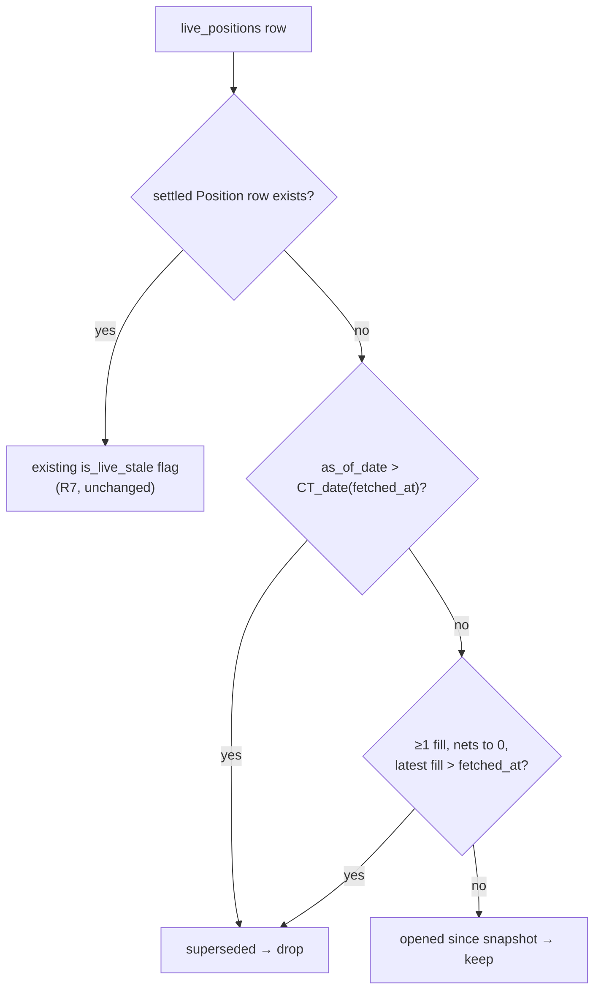

# fix: Invalidate the live position overlay when settled data supersedes it

> Written against placeholders per the AGENTS.md genericization rule. Concrete
> holdings, counts, trade dates, and the diagnostic queries live in the
> gitignored `scratchpad/2026-08-29-stale-overlay-evidence.md`, which carries the
> placeholder map. Placeholders below: `<AS_OF>` (settled snapshot date),
> `<CAPTURE_TS>` / `<CAPTURE_DATE_CT>` (last overlay write), `<N_PHANTOM>`,
> `<N_POSITIONS>`, `<CLOSE_WINDOW>`, `<N_FILLS_SAMPLED>`.

## Goal Capsule

**Objective.** Make the settled FlexQuery snapshot invalidate stale rows in the
live TWS position overlay, so positions closed since the last TWS capture stop
rendering as held — without requiring a TWS connection to clear them.

**Authority hierarchy.** This plan's Key Technical Decisions govern. Where the
plan is silent, follow existing patterns in `src/services/intraday_sync_tws.py`
(the settled-wins purge) and `AGENTS.md`.

**Stop conditions.** Surface a blocker rather than guessing if: the purge would
delete rows with no settled snapshot to fall back to for an account that has
never synced flex; or the mark-age cap requires changing `LatestQuote` schema.

---

## Product Contract

### Summary

The intraday overlay layers live TWS state (`live_positions`) over the settled
FlexQuery snapshot (`positions`). The overlay has exactly one writer — the TWS
sync — so when a position closes and flex correctly drops it, the overlay row
survives and the API renders a closed position as held. `<N_PHANTOM>` such rows
are live in prod today. The origin plan
(`docs/plans/2026-06-09-001-feat-intraday-tws-overlay-plan.md`, "Settle handoff")
designed this handoff for `live_executions` only; positions were never given one.

### Requirements

- **R1.** A position closed after the last live capture must stop rendering as
  held once settled data covering the close has been imported.
- **R2.** A position genuinely opened since the last settled snapshot must keep
  rendering — the fix must not over-purge.
- **R3.** Invalidation must not require a TWS connection. The settled sync is the
  trigger.
- **R4.** A contract that left the book by expiry — producing no closing fill —
  must clear.
- **R5.** A futures mark older than one hour must not present as live.
- **R6.** Equity marks must not be age-capped; a closing mark stays valid.
- **R7.** ~~Existing `is_live_stale` behavior for rows that have both a live and
  a settled row is unchanged.~~ **Superseded — this requirement was wrong.** See
  R8/R9; the behavior it protected was itself the bug.
- **R8.** A stale overlay must not supply quantity, cost, or `source` when a
  newer settled snapshot exists. `live_is_stale` gates the _data_, not just the
  label. The row is still not dropped — a held position stays visible.
- **R9.** `avg_cost` must carry one unit convention regardless of which source
  supplied it.

### Scope Boundaries

**In scope.** Position-row invalidation (write-time and read-time), and the
futures mark-age cap.

**Non-goals.**

- Automating or scheduling the TWS refresh.
- An exchange-session calendar, holiday table, or per-venue trading hours.
- The `live_executions` settle handoff — it already works and is untouched.
- The T-1 flex lag itself.

### Deferred to Follow-Up Work

- A "no longer held" tombstone instead of silent removal (considered and
  declined this round; silent removal is the chosen behavior).
- `latest_quote` row cleanup — stale quotes become unreachable once their live
  position row is gone, so they are inert rather than wrong.

---

## Planning Contract

### Key Technical Decisions

**KTD1. One universal invalidation rule; no `sec_type` branching.**
_(session-settled: user-approved — chosen over separate equity and futures
session rules: a `sec_type` split misfiles US equities traded on the overnight
Blue Ocean session and foreign listings, both present in this book, while a
one-day bound holds for every venue.)_

Every venue's trade date is at most one day ahead of the Chicago calendar date
(CME rolls at 17:00 CT; Blue Ocean ATS runs 20:00–04:00 ET; ASX and Tokyo shift
one day forward from CT). Requiring the settled `as_of_date` to be **strictly
greater** than the capture's CT date guarantees the snapshot postdates the
capture for any instrument. Governs R1, R2.

**KTD2. Two independent purge signals.**
_(session-settled: user-approved — chosen over fill-matching alone: identity
matching cannot see expiry, which produces no closing fill.)_

The watermark is eventually correct for everything including expiry; the
net-zero-fill check clears same-day closes without waiting for the next flex
import. Governs R1, R4.

**KTD3. Write-time delete, backed by a read-time filter.**
_(session-settled: user-approved — chosen over read-time filtering alone: a
missed read site is precisely how this bug shipped — two read paths each had to
get the check right independently and both were blind.)_

Mirrors the established pattern: `_purge_settled` deletes at write time while
`trades.py`, `trade_groups.py`, and `trade_group_pnl.py` each independently
filter settled executions at read time. Governs R1, R3.

**KTD4. One-hour freshness cap on futures marks; none on equity marks.**
_(session-settled: user-directed — chosen over 15 minutes and over a
session-boundary-only rule.)_

Futures trade ~23h, so an hours-old mark during an open session is genuinely
stale; an equity mark from the close is valid all evening. This is the one place
asset class legitimately governs, because it keys on how continuously the
instrument trades. Governs R5, R6.

**KTD5. An anchor is the correct primitive here.**
The repo learning `docs/solutions/logic-errors/tws-fills-window-anchored-to-session-roll.md`
warns against anchors for retention windows. That warning explicitly exempts the
use here: _"Use an anchor only when the semantics genuinely are 'since the
boundary' — labeling a trade date."_ This computes which trade date a capture
belongs to, not how much history to retain. Recorded so review does not
re-litigate it.

**KTD6. A stale overlay is superseded data, so it loses to the settled snapshot.**
_(Corrects R7, which asserted the opposite and was wrong.)_

The original plan treated the live+settled path as already correct and made
preserving it a requirement. It was not correct: `list_positions` took
`position`, `avg_cost`, and `source` from the live row whenever one existed,
consulting `is_live_stale` only to set a display flag. A Saturday request
therefore answered from a Tuesday capture while Friday's snapshot sat unused.

R7 was assumed, never tested. It also actively suppressed the fix — when an
earlier pass changed that path, the failing test read as an R7 violation and the
old behavior was restored. Recorded so the reasoning is visible rather than
looking like churn.

The row is still not dropped: a held position stays on screen with the settled
numbers, and the flag reports that an older capture exists and how old it is.

**KTD7. Normalize `avg_cost` to the multiplier-inclusive convention at the read
boundary.** _(session-settled: user-directed — chosen over normalizing in the
sync, after an investigation the user asked for before any code changed.)_

The two sources disagree by design: TWS reports `avgCost` already multiplied
out, FlexQuery's `costBasisPrice` is per-unit. Every consumer — `compute_unrealized`
and the frontend's Cost Basis column — computes `qty * avg_cost` and reads
dollars, so the settled value is scaled up rather than the live value scaled
down. Applied at the read boundary, so the stored column still matches the raw
IBKR report.

This was a live bug on its own: nine settled-backed rows reported cost basis
100x or 1000x too small. Fixing it was also a prerequisite for KTD6 — the
fallback alone would have spread that error from 9 rows to 62.

### Assumptions

- `positions.as_of_date` is IBKR's `reportDate`. Verified across `<N_FILLS_SAMPLED>`
  flex fills: `reportDate == tradeDate` in every sample, and every FUT/FOP fill at
  or after 17:00 CT carries the next day's trade date.
- Deleting overlay rows needs no Alembic migration — it is ordinary sync
  behavior on a table the sync already owns, not a schema or seed change.
- The 12 existing phantom rows clear on the next flex position sync. No manual
  cleanup or backfill step.

### High-Level Technical Design

Disposition for one `(account, con_id)` in the overlay:

The same predicate backs both the write-time delete and the read-time filter, so
the two halves cannot drift.

---

## Implementation Units

### U1. Supersede predicate and mark-freshness helper

**Goal.** One tested home for both rules, so the write and read paths share
logic.

**Requirements.** R1, R2, R4, R5, R6.

**Dependencies.** None.

**Files.**

- `src/services/intraday_overlay.py` (modify)
- `tests/test_intraday_overlay.py` (create)

**Approach.**

1. Add `ct_date(moment) -> date` — the `America/Chicago` calendar date of a
   tz-aware instant. Sits alongside the existing `_midnight_mt` helper; do not
   replace `_midnight_mt`, which `is_live_stale` still uses for R7.
2. Add `is_overlay_superseded(live_fetched_at, account_as_of_date) -> bool`
   returning `account_as_of_date > ct_date(live_fetched_at)`, with `None` on
   either side returning `False`.
3. Add `mark_if_fresh(mark, market_ts, sec_type, now) -> float | None` — returns
   `None` for a `FUT`/`FOP` mark whose `market_ts` is older than one hour;
   returns the mark unchanged for every other `sec_type`, and when `market_ts`
   is `None`. Express the hour as a module constant.

**Patterns to follow.** `is_live_stale` for the tz-aware, `None`-guarded,
pure-function shape.

**Test scenarios.**

- `ct_date` returns the next calendar day for a late-evening MT instant that is
  already past midnight in Chicago (the shape of the capture behind this bug).
- `is_overlay_superseded` is `True` when `as_of` is two days after the capture's
  CT date.
- `is_overlay_superseded` is `False` when `as_of` equals the capture's CT date
  (the strict-`>` boundary that protects an overnight futures capture).
- `is_overlay_superseded` is `False` for a ~21:00 ET overnight-session equity
  capture against a same-dated `as_of`.
- `is_overlay_superseded` is `False` when either argument is `None`.
- `mark_if_fresh` nulls a `FUT` mark 90 minutes old; keeps one 10 minutes old.
- `mark_if_fresh` keeps a `STK` mark 6 hours old, and an `OPT` mark 6 hours old.
- `mark_if_fresh` returns the mark unchanged when `market_ts` is `None`.

**Verification.** New test module passes; `is_live_stale` behavior unchanged.

---

### U2. Purge superseded overlay rows when settled positions land

**Goal.** The settled sync becomes the invalidation trigger, so the overlay
expires without TWS (R3).

**Requirements.** R1, R3, R4.

**Dependencies.** U1.

**Files.**

- `src/services/position_sync_flexquery.py` (modify)
- `tests/test_position_sync_purge.py` (create)

**Approach.**

1. In `sync_flex_positions`, after the existing upsert and stale-`con_id` delete
   and inside the same `Session`, delete `LivePosition` rows for this
   `account_id` where `is_overlay_superseded(fetched_at, as_of)` holds. Express
   as a set-based `delete()` with a computed cutoff instant rather than a
   per-row Python loop.
2. Guard on `as_of is not None` — a report with no resolvable `reportDate`
   purges nothing.
3. Add the net-zero-fill purge: delete overlay rows for this account whose
   `(account_id, con_id)` has at least one canonical `TradeExecution`, whose
   `SUM(quantity)` is zero, and whose latest `executed_at` postdates the
   overlay row's `fetched_at`. The `≥1 fill` guard is load-bearing — zero fills
   means transferred-in lots or fills predating the sync window, not a close
   (`src/api/routers/positions.py:288` documents this).
4. Return `live_purged` in the metrics dict and log it beside the existing
   `deleted` count.

**Execution note.** `quantity` is already signed in `trade_executions` — a sell
is negative. Do not re-apply a sign from `side`.

**Patterns to follow.** `_purge_settled` in `src/services/intraday_sync_tws.py`
— same transaction as the write, count returned in the result dict.

**Test scenarios.**

- An overlay row whose CT capture date precedes the account `as_of`, with no
  settled position row, is deleted.
- An overlay row captured the same CT date as `as_of` survives.
- An overlay row for a position with two canonical fills netting to zero, latest
  fill after the capture, is deleted even when the watermark has not yet passed.
- An overlay row whose instrument has zero fills survives (transferred-in lot).
- An overlay row whose fills net non-zero survives (opened since the snapshot).
- A report resolving no `as_of` purges nothing and does not raise.
- Purging is scoped to the synced account — another account's overlay rows are
  untouched.
- The returned metrics include a `live_purged` count.

**Verification.** Running the sync against a fixture with a superseded row
reports `live_purged >= 1` — observe the mechanism fire, not merely that no
phantoms remain (per the repo learning on proving invariants).

---

### U3. Filter superseded rows out of the positions endpoint

**Goal.** Close the read-side hole that renders phantoms today.

**Requirements.** R1, R2, R7.

**Dependencies.** U1.

**Files.**

- `src/api/routers/positions.py` (modify)
- `tests/test_positions_api.py` (create)

**Approach.**

1. Build an account-level `max(as_of_date)` map from the `Position` rows already
   loaded in `list_positions` — no extra query.
2. In the live-only loop (the "opened-today" branch), skip a row when
   `is_overlay_superseded(live.fetched_at, account_as_of[account_id])` holds.
   This replaces the current `is_live_stale(live.fetched_at, None)` call, which
   is structurally always `False`.
3. Leave the live+settled branch untouched (R7).

**Patterns to follow.** The existing `flex_keys` set and single-pass dict lookups
in `list_positions`; add no per-row queries.

**Test scenarios.**

- A live-only row whose account has a newer settled `as_of` is absent from the
  response.
- A live-only row whose account has no newer settled snapshot is present, with
  `source == "live"` and `data_source == "tws-live"`.
- A live+settled row still returns `live_is_stale` per existing behavior (R7
  regression guard).
- An account with no settled rows at all keeps all its live-only rows.
- Response row count drops by exactly the number of superseded rows.

**Verification.** `GET /api/v1/positions` returns no row for a superseded
instrument; live-only rows for genuinely new positions still appear.

---

### U4. Filter superseded rows out of trade-group P&L

**Goal.** Same hole in the group path — the Strategy view renders phantoms in
OPEN POSITIONS and folds them into intraday totals.

**Requirements.** R1, R2.

**Dependencies.** U1.

**Files.**

- `src/services/trade_group_pnl.py` (modify)
- `tests/test_trade_group_pnl_batch.py` (extend)

**Approach.**

1. The live-row selection currently filters only on `position != 0`. Load the
   account-level `max(as_of_date)` alongside the existing `flex_rows` query and
   drop superseded live rows before they reach `merge_positions`.
2. **Only rows with no settled counterpart are candidates for dropping.** A live
   row that has a settled row behind it is _held_, not closed, and must keep the
   existing `is_live_stale` flag (R7) — dropping it would hide a real position.
   Scope the filter with a `settled_keys` set built from `flex_rows`, matching
   how U3 confines the check to the live-only branch.
3. Excluding them at selection means `overlay_totals` and `_group_live_is_stale`
   need no change — they operate on what survives.
4. The account-level `max(as_of_date)` needs its own query (the existing
   `flex_rows` are pair-scoped, and a superseded row's contract is by definition
   absent from them). Update the docstring's fixed query count accordingly.

**Patterns to follow.** The batched loading already in `trade_group_batch_pnls`;
keep it batch-shaped, no per-group queries.

**Test scenarios.**

- A group holding one superseded live row and one live row reports open
  positions for the live row only.
- Intraday unrealized excludes the superseded row's contribution.
- A group whose every live row is superseded falls back to settled rows.
- Existing batch P&L assertions still pass (regression guard).

**Verification.** The group that surfaced this bug shows no open position for
the closed instrument; realized P&L is unchanged.

---

### U5. Cap futures mark age

**Goal.** Stop an hours-old futures mark presenting as a live price (R5), while
leaving equity marks alone (R6).

**Requirements.** R5, R6.

**Dependencies.** U1.

**Files.**

- `src/api/routers/positions.py` (modify)
- `src/services/intraday_overlay.py` (modify — `merge_positions` mark resolution)
- `tests/test_positions_api.py` (extend)

**Approach.**

1. Apply `mark_if_fresh` at each site that resolves a mark from `LatestQuote`,
   immediately after the existing non-positive-sentinel rejection and
   `normalize_live_mark` call.
2. A capped mark behaves exactly like an absent one: `mark`, `mark_ts`, and
   `live_unrealized` go null and the UI renders "—". Do not substitute the
   settled mark into the live column — the existing comment in
   `list_positions` states this rule.

**Test scenarios.**

- A `FUT` position with a 90-minute-old quote returns `mark is None` and
  `live_unrealized is None`.
- The same position with a 10-minute-old quote returns the mark.
- A `STK` position with a 6-hour-old quote returns the mark.
- An `OPT` position with a 6-hour-old quote returns the mark.
- Group intraday totals skip a capped-out futures row rather than treating its
  mark as zero.

**Verification.** A futures row with a stale quote shows no live mark; the
equity rows beside it are unaffected.

---

## Verification Contract

- `task test` — full suite green.
- `task test -- -k "overlay or position or pnl" -v` — targeted.
- `uv run python scripts/check.py src.services.intraday_overlay src.services.position_sync_flexquery src.api.routers.positions src.services.trade_group_pnl`
- `uv run ruff check` — **not** `ruff format`. The repo is not ruff-formatted;
  formatting these files produces pure churn (per the repo learning).
- `uv run python scripts/docs_check.py` if any doc changes.

**Post-deploy check.** Restart the jobs worker before enqueuing a sync — it
caches `src.models` and the sync modules in memory, so a job enqueued after an
edit runs the old code (per the repo learning).

---

## Definition of Done

- All `<N_PHANTOM>` phantom rows are absent from `GET /api/v1/positions`; the
  response drops by exactly that count (see the scratchpad evidence file for the
  expected before/after totals).
- The first post-deploy flex position sync reports `live_purged >= 1`.
- A live-only row for a position genuinely opened since the last settled
  snapshot still renders.
- `live_is_stale` behavior for live+settled rows is unchanged.
- A futures mark older than one hour presents as "—"; equity marks do not.
- No Alembic migration was added.
- Test suite green; imports check clean; `ruff check` clean.

---

## Risks

- **Over-purge hides a real position.** Mitigated by strict `>` on the watermark
  and the `≥1 fill` guard on the fill signal. The residual window — a position
  closed today, before today's flex import lands — is inherent to the T-1 feed
  and clears on the next import.
- **The account-level `as_of` map is wrong for a never-synced account.** An
  account with no `Position` rows has no `as_of`, so the predicate returns
  `False` and every live row survives. This is the intended fallback.
- **Read and write predicates drift.** Mitigated by U1 — one function, both
  call sites.

---

## Sources & Research

Full evidence, queries, and concrete values:
`scratchpad/2026-08-29-stale-overlay-evidence.md` (gitignored).

- Reproduced against the running API: `<N_PHANTOM>` live-only rows, majority
  FOP. Every one returns `live_is_stale: False`, while the large majority of
  settled-backed rows are correctly flagged — only the live-only path is blind.
- Every phantom nets to zero across its canonical fills, with closes inside
  `<CLOSE_WINDOW>`, all at or before `<AS_OF>`.
- IBKR trade-date convention confirmed on `<N_FILLS_SAMPLED>` flex fills: every
  FUT/FOP fill at or after 17:00 CT carries the next day's `tradeDate`, and
  `reportDate` always equals `tradeDate`. `OPT` shows zero evening fills.
- Overnight/foreign equity counterexamples exist in the book: US equity fills on
  the Blue Ocean overnight session (20:00–04:00 ET) and foreign-listed equity
  fills on ASX both carry next-day `tradeDate`. This is what a `sec_type` split
  would misfile and the universal +1-day bound handles.
- `docs/plans/2026-06-09-001-feat-intraday-tws-overlay-plan.md` — origin design;
  its "Settle handoff" covers executions only.
- `docs/solutions/logic-errors/tws-fills-window-anchored-to-session-roll.md` —
  anchor-vs-duration guidance, the settled-wins two-mechanism pattern, the
  prove-invariants-fire discipline, and the worker-restart and ruff-format notes.
- `docs/solutions/logic-errors/position-trade-group-chips-included-closed-lots.md`
  — prior art on open-lot vs per-instrument attribution.
